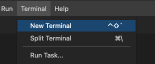
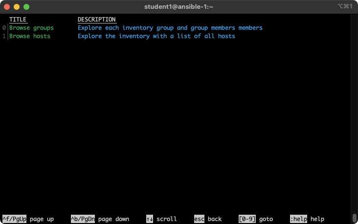
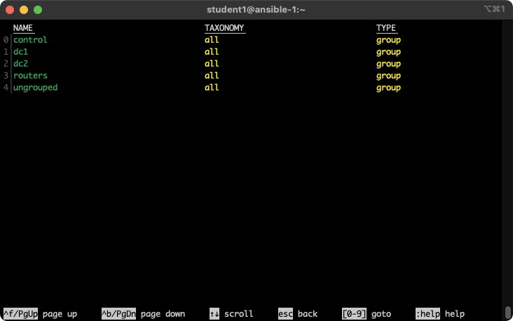
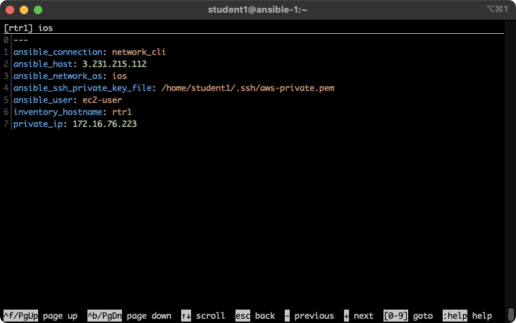

# Ejercicio 1 - Explorando el entorno de laboratorio

**Leálo en otros idiomas**:  [English](README.md),   [日本語](README.ja.md),  [Español](README.es.md).

## Índice

* [Objetivo](#objective)
* [Diagrama](#diagram)
* [Guía](#guide)
   * [Paso 1 - Connectar vía VS Code](#step-1---connecting-via-vs-code)
   * [Paso 2 - Usando la Terminal](#step-2---using-the-terminal)
   * [Paso 3 - Examinando los Entornos de Ejecución ](#step-3---examining-execution-environments)
   * [Paso 4 - Examinando la configuración de ansible-navigator](#step-4---examining-the-ansible-navigator-configuration)
   * [Paso 5 - Examinando el inventario](#step-5---examining-inventory)
   * [Paso 6 - Comprendiendo el inventario](#step-6---understanding-inventory)
   * [Paso 7 - Usando ansible-navigator para explorar el inventario](#step-7---using-ansible-navigator-to-explore-inventory)
   * [Paso 8 - Connectándose a dispositivos de red](#step-8---connecting-to-network-devices)
* [Completo](#complete)

## Objetivo

Explorar y comprender el entorno de laboratorio.

Estos primeros ejercicios de laboratorio consistirán en explorar las utilidades de línea de comando de Ansible Automation Platform.
Esto incluye:

- [ansible-navigator](https://github.com/ansible/ansible-navigator) - una utilidad de línea de comando e interfaz de usuario basado en texto (TUI) para ejecutar y desarrollar contenido de automatización de Ansible.
- [ansible-core](https://docs.ansible.com/core.html) - el ejecutable que provee el marco, lenguaje y funciones que componen Ansible Automation Platform. También incluye varias utilidades de línea de comandos como `ansible`, `ansible-playbook` y `ansible-doc`.  Ansible Core actúa como el puente entre la comunidad upstream y los contenidos open source y gratuítos de Ansible además de conectarlo con la oferta empresarial de automatización downstream de Red Hat, el producto Ansible Automation Platform.
- [Entornos de Ejecución](https://docs.ansible.com/automation-controller/latest/html/userguide/execution_environments.html) - no cubiertos específicamente en este taller puesto que el entorno de Ansible Execution Environments ya está incluído en todas las colecciones soportadas de Red Hat que comprenden todas las colecciones de red utilizadas en este taller. Los Entornos de Ejecución son imágenes de contenedores que pueden ser usadas como ejecuciones de Ansible.
- [ansible-builder](https://github.com/ansible/ansible-builder) - como el anterior, no cubierto específicamente en este taller, `ansible-builder` es una utilidad de línea de comando para automatizar el proceso de creación de Entornos de Ejecución.

Si necesitaás más informacion sobre los nuevos componentes de Ansible Automation Platform, añáde esta página [https://red.ht/AAP-20](https://red.ht/AAP-20) a tus marcadores.

> Chatea con nosotros
>
> Antes de comenzar, por favor, únete a nosotros en slack <a href="https://join.slack.com/t/ansiblenetwork/shared_invite/zt-3zeqmhhx-zuID9uJqbbpZ2KdVeTwvzw">Haz click aquí para unirte al canal de slack ansiblenetwork</a>. Esto te permitirá chatear con otros ingeniero de automatización de redes y obtener ayuda una vez concluídos los talleres. Si el enlace no funcionase, por favor envíanos un email a <a href="mailto:ansible-network@redhat.com">Ansible Technical Marketing</a></th>


## Diagrama


## Guía

### Paso 1 - Connectar vía VS Code

<table>
<thead>
  <tr>
    <th> Se recomienda el uso de Visual Studio Code para completar los ejercicios. Visual Studio Code provee:
    <ul>
    <li>Un explorador de ficheros</li>
    <li>Un editor de texto con sintaxis resaltada</li>
    <li>Una terminal embebida</li>
    </ul>
    El acceso directo por SSH está disponible como backup, o si Visual Studio Code no fuera suficiente para el estudiante.  Aquí hay un pequeño vídeo de YouTube (en inglés) en caso de necesitar más claridad: <a href="https://youtu.be/Y_Gx4ZBfcuk">Ansible Workshops - Accessing your workbench environment</a>.
</th>
</tr>
</thead>
</table>

- Conéctate a Visual Studio Code desde la página inicial del taller (provista por el instructor). La password se provee bajo el enlace de WebUI.

  

- Introduce la contraseña que se te ha provisto para poder ingresar.

  

- Abre el directorio `network-workshop` en Visual Studio Code:

  

- Haz click en el finchero `playbook.yml` para ver el contenido.

  

### Paso 2 - Usando la Terminal

- Abre una terminal en Visual Studio Code:

  

Navega hasta el directorio `network-workshop` en la terminal del nodo de control de Ansible.

```bash
[student1@ansible-1 ~]$ cd ~/network-workshop/
[student1@ansible-1 network-workshop]$ pwd
/home/student1/network-workshop
[student1@ansible-1 network-workshop]$
```

* `~` - la tilde en este contexto es un atajo para el directorio, ej. `/home/student1`
* `cd` - comando de Linux para cambiar de directorio.
* `pwd` - comando de Linux para mostrar el directorio de trabajo. Con esto, se mostrará el `path` completo al directorio de trabajo actual.

### Paso 3 - Examinando los Entornos de Ejecución

Ejecuta el comando `ansible-navigator` con el argumento `images` para ver los entornos de ejecución configurados en el nodo de control:

```bash
$ ansible-navigator images
```


> Nota
>
> La salida mostrada puede diferir de la anteriomente mostrada

Este comando da información sobre todos los Entornos de Ejecución actualmente instalados (EE para abreviar). Investiga un EE pulsando el número correspondiente. Por ejemplo, pulsando **2** con el ejemplo anterior, abrirá el EE `ee-supported-rhel8`:


Seleccionar `2` para `Ansible version and collections` mostrará todas las Colecciones de Ansible (Ansible Collections) instaladas para ese EE en particular, y la versión de `ansible-core`:


### Paso 4 - Examinando la configuración de ansible-navigator

Ejecuta tanto Visual Studio Code como el comando `cat` para ver el contenido del fichero `ansible-navigator.yml`. El fichero se encuentra en el directorio home:

```bash
$ cat ~/.ansible-navigator.yml
---
ansible-navigator:
  ansible:
    inventories:
    - /home/student1/lab_inventory/hosts

  execution-environment:
    image: registry.redhat.io/ansible-automation-platform-20-early-access/ee-supported-rhel8:2.0.0
    enabled: true
    container-engine: podman
    pull-policy: missing
    volume-mounts:
    - src: "/etc/ansible/"
      dest: "/etc/ansible/"
```

Fíjate en los siguientes parámetros del fichero `ansible-navigator.yml`:

* `inventories`: muestra la ubicación del inventario de ansible actualmente en uso.
* `execution-environment`: dónde está configurado el entorno de ejecución por defecto.

Para ver un listado completo con todas las opciones configurables, consulta la [documentación](https://ansible-navigator.readthedocs.io/en/latest/settings/)

### Paso 5 - Examinando el inventario

The scope of a `play` within a `playbook` is limited to the groups of hosts declared within an Ansible **inventory**. Ansible supports multiple [inventory](http://docs.ansible.com/ansible/latest/intro_inventory.html) types. An inventory could be a simple flat file with a collection of hosts defined within it or it could be a dynamic script (potentially querying a CMDB backend) that generates a list of devices to run the playbook against.

In this lab you will work with a file based inventory written in the **ini** format. Either use Visual Studio Code to open or use the `cat` command to view the contents of the `~/lab_inventory/hosts` file.

```bash
$ cat ~/lab_inventory/hosts
```

```bash
[all:vars]
ansible_ssh_private_key_file=~/.ssh/aws-private.pem

[routers:children]
cisco
juniper
arista

[cisco]
rtr1 ansible_host=18.222.121.247 private_ip=172.16.129.86
[arista]
rtr2 ansible_host=18.188.194.126 private_ip=172.17.158.197
rtr4 ansible_host=18.221.5.35 private_ip=172.17.8.111
[juniper]
rtr3 ansible_host=3.14.132.20 private_ip=172.16.73.175

[cisco:vars]
ansible_user=ec2-user
ansible_network_os=ios
ansible_connection=network_cli

[juniper:vars]
ansible_user=ec2-user
ansible_network_os=junos
ansible_connection=netconf

[arista:vars]
ansible_user=ec2-user
ansible_network_os=eos
ansible_connection=network_cli
ansible_become=true
ansible_become_method=enable

[dc1]
rtr1
rtr3

[dc2]
rtr2
rtr4

[control]
ansible ansible_host=13.58.149.157 ansible_user=student1 private_ip=172.16.240.184
```

### Paso 6 - Comprendiendo el inventario

In the above output every `[ ]` defines a group. For example `[dc1]` is a group that contains the hosts `rtr1` and `rtr3`. Groups can also be _nested_. The group `[routers]` is a parent group to the group `[cisco]`

Parent groups are declared using the `children` directive. Having nested groups allows the flexibility of assigining more specific values to variables.

We can associate variables to groups and hosts.

> Note:
>
> A group called **all** always exists and contains all groups and hosts defined within an inventory.

Host variables can be defined on the same line as the host themselves. For example for the host `rtr1`:

```sh
rtr1 ansible_host=18.222.121.247 private_ip=172.16.129.86
```

* `rtr1` - The name that Ansible will use.  This can but does not have to rely on DNS
* `ansible_host` - The IP address that ansible will use, if not configured it will default to DNS
* `private_ip` - This value is not reserved by ansible so it will default to a [host variable](http://docs.ansible.com/ansible/latest/intro_inventory.html#host-variables).  This variable can be used by playbooks or ignored completely.

Group variables groups are declared using the `vars` directive. Having groups allows the flexibility of assigning common variables to multiple hosts. Multiple group variables can be defined under the `[group_name:vars]` section. For example look at the group `cisco`:

```sh
[cisco:vars]
ansible_user=ec2-user
ansible_network_os=ios
ansible_connection=network_cli
```

* `ansible_user` - The user ansible will be used to login to this host, if not configured it will default to the user the playbook is run from
* `ansible_network_os` - This variable is necessary while using the `network_cli` connection type within a play definition, as we will see shortly.
* `ansible_connection` - This variable sets the [connection plugin](https://docs.ansible.com/ansible/latest/plugins/connection.html) for this group.  This can be set to values such as `netconf`, `httpapi` and `network_cli` depending on what this particular network platform supports.

### Paso 7 - Usando ansible-navigator para explorar el inventario

We can also use the `ansible-navigator` TUI to explore inventory.

Run the `ansible-navigator inventory` command to bring up inventory in the TUI:



Pressing **0** or **1** on your keyboard will open groups or hosts respectively.



Press the **Esc** key to go up a level, or you can zoom in to an individual host:



### Paso 8 - Connectándose a dispositivos de red

There are four routers, named rtr1, rtr2, rtr3 and rtr4.  The network diagram is always available on the [network automation workshop table of contents](../README.md).  The SSH configuration file (`~/.ssh/config`) is already setup on the control node.  This means you can SSH to any router from the control node without a login:

For example to connect to rtr1 from the Ansible control node, type:

```bash
$ ssh rtr1
```

For example:
```
$ ssh rtr1
Warning: Permanently added 'rtr1,35.175.115.246' (RSA) to the list of known hosts.


rtr1#show ver
Cisco IOS XE Software, Version 16.09.02
```

## Complete

You have completed lab exercise 1!  

You now understand:

* How to connect to the lab environment with Visual Studio Code
* How to explore **execution environments** with `ansible-navigator`
* Where the Ansible Navigator Configuration (`ansible-navigator.yml`) is located
* Where the inventory is stored for command-line exercises
* How to use ansible-navigator TUI (Text-based user interface)


---
[Next Exercise](../2-first-playbook/README.md)

[Click Here to return to the Ansible Network Automation Workshop](../README.md)
