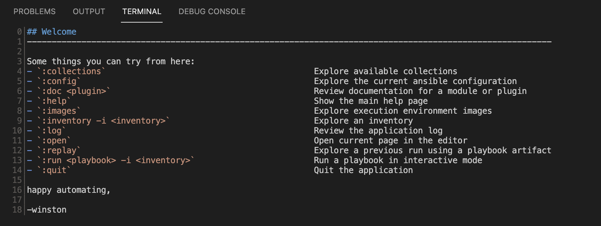

# Ejercicio 3: Ansible Facts

**Leálo en otros idiomas**:  [English](README.md),   [日本語](README.ja.md),  [Español](README.es.md).

## Índice

* [Objetivo](#objetivo)
* [Guía](#guía)
   * [Paso 1 - Usando la documentación](#Paso-1---usando-la-documentación)
   * [Paso 2 - Creando el play](#Paso-2---creando-el-play)
   * [Paso 3 - Crear la tarea de facts](#Paso-3---crear-la-tarea-de-facts)
   * [Paso 4 - Ejecutando el playbook](#Paso-4---ejecutando-el-playbook)
   * [Paso 5 - Usando el módulo de debug](#Paso-5---usando-el-módulo-de-debug)
   * [Paso 6 - Usando la salida estándar stdout](#Paso-6---usando-la-salida-estándar-stdout)
* [Consejos a recordar](#consejos-a-recordar)
* [Solución](#solución)
* [Completado](#completado)

## Objetivo

Demostración del uso de los hechos de Ansible (en adelante, Ansible facts) en una infraestructura de red.

Los hechos de Ansible (facts) son información derivada de la comunicación con elementos de red remotos. Los 'facts' son devueltos en forma de datos estructurados (JSON) lo que hace que sean fácilmente manipulables o modificables. Por ejemplo, un ingeniero de red podría crear un reporte de auditoría muy rápidamente usando los 'facts' de Ansible y creando una plantilla en un fichero markdown o HTML.

Este ejercicio cubrirá:

* Crear un Playbook de Ansible desde cero.
* Usar `ansible-navigator :doc` para la búsqueda de documentación
* Usar el módulo [cisco.ios.facts](https://docs.ansible.com/ansible/latest/collections/cisco/ios/ios_facts_module.html).
* Usar el módulo [debug](https://docs.ansible.com/ansible/latest/modules/debug_module.html).

## Guía

### Paso 1 - Usando la documentación

Ejecuta el comando `ansible-navigator` en modo interactivo en la terminal

```bash
$ ansible-navigator
```

pantallazo de `ansible-navigator`:


En el pantallazo anterior se puede ver una línea por cada documentación de módulo o plugin:
 
```
`:doc <plugin>`                 Review documentation for a module or plugin
 ```

Lets example the `debug` module by typing `:doc debug`

```bash
:doc debug
```

pantallazo de `ansible-navigator :doc debug`:


La documentación para el módulo de `debug` se muestra en la sesión de terminal interactiva. Es una representación en YAML de la misma documentación que está disponible en [docs.ansible.com](https://docs.ansible.com/ansible/latest/collections/ansible/builtin/debug_module.html). Los ejemplos pueden ser copiados y pegados directamente del módulo de documentación en un Playbook de Ansible.

Cuando nos referimos a un módulo no embebido, hay tres campos importantes:

```
namespace.collection.module
```
Por ejemplo:
```
cisco.ios.facts
```

Explicación de términos:
- **namespace** - ejemplo **cisco** - Un espacio de nombres ('namespace') es una agrupación de colecciones múltiples. El espacio de nombres **cisco** contiene múltiples colecciones, incluyendo **ios**, **nxos**, e **iosxr**.
- **collection** - ejemplo **ios** - Una colección es  es un formato de distribución para contenido de Ansible que incluye playbooks, roles, módulos, y plugins. La colección **ios** contiene todos los módulos del Cisco IOS/IOS-XE.
- **module** - ejemplo 'facts' - Los módulos son unidades discretas de código que puede usarse en una tarea de un playbook. Por ejemplo, los módulos de **facts** devolverán datos estructurados acerca de un determinado sistema.

Pulsa la tecla **Esc** para volver al menú principal. Intenta repetir el comando `:doc` con el módulo `cisco.ios.facts`.

```bash
:doc cisco.ios.facts
```

Usaremos el módulo 'facts' en nuestro playbook.

### Paso 2 - Creando el play

Los ficheros de Playbook de Ansible están en [**YAML** files](https://yaml.org/). YAML es un formato de codificación estructurado que, además, es extremadamente leíble por los humanos (al contrario que su subconjunto - el formato JSON)

Crea un nuevo fichero en Visual Studio Code:


Para simplificar, llama al fichero de playbook: `facts.yml`:


Inserta el siguiente play dentro del fichero `facts.yml`:

```yaml
---
- name: gather information from routers
  hosts: cisco
  gather_facts: no
```

Expliquemos cada línea:

* La primera línea, `---` indica que es un fichero YAML.
* La palabra clave `- name:` es una descipción opcional para el Playbook de Ansible en particular.
* La palabra clave `hosts:` significa este playbook se ejecutará en el grupo `cisco` definido en el archivo de inventario.
* La directiva `gather_facts: no` se requiere desde Ansible 2.8 y anteriores, sólo funciona en hosts Linux, y no en una infraestructura de red. La usaremos en un módulo específico para obtener los 'facts' para un dispositivo de red.

### Paso 3 - Crear la tarea de facts

Next, add the first `task`. This task will use the `cisco.ios.facts` module to gather facts about each device in the group `cisco`.

```yaml
---
- name: gather information from routers
  hosts: cisco
  gather_facts: no

  tasks:
    - name: gather router facts
      cisco.ios.facts:
```

> Note:
>
> A play is a list of tasks. Modules are pre-written code that perform the task.

Save the playbook.

### Paso 4 - Ejecutando el playbook

Execute the Ansible Playbook by running `ansible-navigator`:

```sh
$ ansible-navigator run facts.yml
```

This will open an interactive session while the playbook interacts:

Screenshot of facts.yml:


To zoom into the playbook output we can press **0** which will show us a host-centric view.  Since there is only one host, there is just one option.

Screenshot of zooming in:


To see the verbose output of **rtr1** press **0** one more time to zoom into the module return values.

Screenshot of zooming into module data:


You can scroll down to view any facts that were collected from the Cisco network device.

### Paso 5 - Usando el módulo de debug

Write two additional tasks that display the routers' OS version and serial number.

<!--  -->

``` yaml
---
- name: gather information from routers
  hosts: cisco
  gather_facts: no

  tasks:
    - name: gather router facts
      cisco.ios.facts:

    - name: display version
      debug:
        msg: "The IOS version is: {{ ansible_net_version }}"

    - name: display serial number
      debug:
        msg: "The serial number is:{{ ansible_net_serialnum }}"
```

<!--  -->

### Paso 6 - Usando la salida estándar stdout

Now re-run the playbook using the `ansible-navigator` and the `--mode stdout`

The full command is: `ansible-navigator run facts.yml --mode stdout`

Screenshot of ansible-navigator using stdout:


Using less than 20 lines of "code" you have just automated version and serial number collection. Imagine if you were running this against your production network! You have actionable data in hand that does not go out of date.

## Consejos a recordar

* The `ansible-navigator :doc` command will allow you access to documentation without an internet connection.  This documentation also matches the version of Ansible on the control node.
* The [cisco.ios.facts module](https://docs.ansible.com/ansible/latest/collections/cisco/ios/ios_config_module.html) gathers structured data specific for Cisco IOS.  There are relevant modules for each network platform.  For example there is a junos_facts for Juniper Junos, and a eos_facts for Arista EOS.
* The [debug module](https://docs.ansible.com/ansible/latest/modules/debug_module.html) allows an Ansible Playbook to print values to the terminal window.

## Solución

The finished Ansible Playbook is provided here for an answer key: [facts.yml](facts.yml).

## Completado

You have completed lab exercise 3

---
[Previous Exercise](../2-first-playbook/README.md) | [Next Exercise](../4-resource-module/README.md)

[Click here to return to the Ansible Network Automation Workshop](../README.md)
