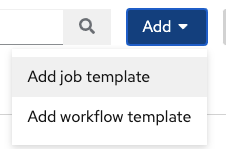
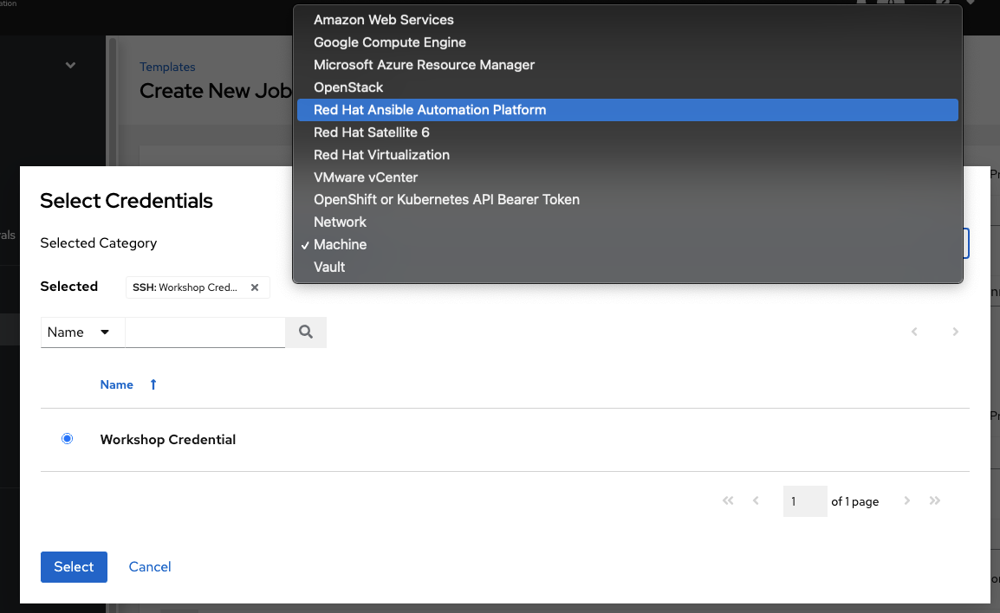
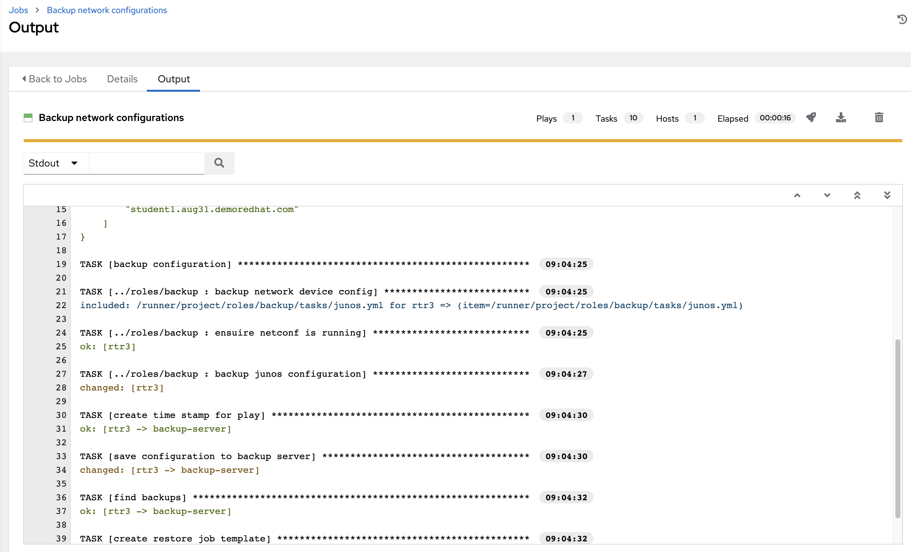

# Ejercicio 6: Crear plantillas de trabajo (Job Templates) en el controlador de Automatización

**Leálo en otros idiomas**:  [English](README.md),   [日本語](README.ja.md),  [Español](README.es.md).

## Índice

* [Objetivo](#objetivo)
* [Guía](#guía)
  * [Paso 1: Crear una plantilla de trabajo, Job Template](#Paso-1-crear-una-plantilla-de-trabajo-job-template)
  * [Paso 2: Lanzar una plantilla de trabajo, Job Template](#Paso-2-lanzar-una-plantilla-de-traabjo-job-template)
  * [Paso 3: Examinar los detalles del trabajo, Job Details View](#Paso-3-examinar-los-detalles-del-trabajo-job-details-view)
  * [Paso 4: Examinar la ventana de trabajos, Jobs](#Paso-4-examinar-la-ventana-de-trabajos-jobs)
  * [Paso 5: Verificar que la copia de seguridad se ha creado](#Paso-5-verificar-que-la-copia-de-seguridad-se-ha-creado)
* [Consejos a recordar](#consejos-a-recordar)
* [Completado](#completado)

## Objetivo

Demostrar una plantilla de trabajo de configuración de copia de seguridad de red con el controlador de Automatización. Esta plantilla de trabajo nos guardará la configuración en ejecución de nuestros cuatro enrutadores y los almacenará en `/backup` del nodo de control con una marca de tiempo.

Para ejecutar un Playbook de Ansible en el controlador de Automatización necesitamos crear una plantilla de trabajo (**Job Template**). Una plantilla de trabajo (**Job Template**) requiere:

* Un **Inventario** contra el que poder ejecutar los trabajos.
* Una **Credencial** para entrar en los dispositivos.
* Un **Proyecto** que contie Playbooks de Ansible.

## Guía

### Paso 1: Crear una plantilla de trabajo, Job Template

* Abre la web UI y haz click en el enlace `Templates` en el menú de la izquierda.

   

* Haz click en el botón azul **Add** para crear una nueva plantilla de trabajo.

   

> Nota:
>
> Asegúrate de seleccionar `job template` y no `workflow template`

* Rellena los parámetros de la plantilla de trabajo como sigue:

  | Parameter | Value |
  |---|---|
  | Name  | Backup network configurations  |
  |  Job Type |  Run |
  |  Inventory |  Workshop Inventory |
  |  Project |  Workshop Project |
  |  Execution Environment | Default execution environment |
  |  Playbook |  playbooks/network_backup.yml |
  |  Credential |  Workshop Credential |

  Pantallazo de los parámetros de la plantilla de trabajo rellenos:
   

* Añade una segunda credencial a la plantilla de trabajo (Job Template).

   La credencial llamada **Controller Credential** también ha de ser añadida a esta particular plantilla de trabajo (Job Template). Lo hacemos para que el controlador de Automatización pueda actualizar los recursos de copias de seguridad que la plantilla de trabajo llamada **Network-Restore** utilizará. El controlador de Automatización se puede actualizar con plantillas de trabajo para añadir o actualizar configuraciones dinámicamente. Seleccciona la segunda credencial del menú desplegable para elegir la credencial de tipo **Red Hat Ansible Automation Platform**:

  

  Cuando ambas credenciales se hayan añadido a la plantilla de trabajo, verás algo similar a la imágen:

  

* Baja y haz click en el botón azul `Save`.

### Paso 2: Lanzar una plantilla de trabajo, Job Template

1. Navega hasta la ventana `Templates`, donde aparecerán todas las plantillas de trabajo (Job Templates).

2. Lanza la plantilla de trabajo `Backup network configurations` haciendo click en el botón del cohete.

    

    Cuando el botón del cohete se pulsa, lanzará el trabajo. El trabajo se abrirá en una nueva ventana llamada **Job Details View**. Más información sobre los [trabajos en el controlador de Automatización](https://docs.ansible.com/automation-controller/latest/html/userguide/jobs.html) se pueden encontrar en la documentación.

### Paso 3: Examinar los detalles del trabajo, Job Details View

Después de ejecutar la plantilla de trabajo, se abrirá automáticamente el [panel de salida estándar](https://docs.ansible.com/automation-controller/latest/html/userguide/jobs.html#standard-out)



1. Examina el **panel de salida estándar**

   El panel de salida estándar mostrará la salida del Plyabook de Ansible. Cada salida de tarea será idéntica de lo que hubiera sido en la línea de comandos.

2. Haz click en la tarea en el **panel de salida estándar** para abrir la salida de una tarea en particular de manera estructurada.

   > Haz click en cualquier línea donde aparezca **changed** u **ok**

   

3. Haz click en la pestaña **Details** para abrir el **panel de detalles**

   El **panel de detalles** mostrará información como las marcas de tiempo para el inicio y fin del trabajo, el tipo de trabajo (Check or Run), el usuario que lanzó el trabajo, qué proyecto y qué Playbook de Ansible fueron usados y más.

   Si el trabajo aún no ha terminado, el **panel de detalles** mostrará un botón **Cancel Job** que puede usarse para parar la ejecución del trabajo.

### Paso 4: Examinar la ventana de trabajos, Jobs

Cualquier **Job Template** (plantill de trabajo) que se ha ejecutado o se está ejecutando aparecerá bajo la ventana **Jobs** (trabajos).

1. Haz click en el botón **Jobs** en el menú de la izquierda.

   

   El enlace **Jobs** muestra una lista de trabajos y su estado como completado, existoso o fallado, o como trabajo en ejecución (running). Las acciones que puedes ejecutar en esta pantalla incluyen ver los detalles y la salida estándar de un trabajo en particular, re-lanzar trabajos o borrar trabajos.

2. Haz click en el trabajo **Backup network configurations**.

   

   El trabajo **Backup network configurations** ha sido el más reciente en ser ejecutado (a no ser que hayas lanzado más trabajos). Haz click en este trabajo para volver al **panel de salida estándar**. El controlador de Automatización guardará un histórico por cada trabajo lanzado.

### Paso 5: Verificar que la copia de seguridad se ha creado

* En la línea de comandos del nodo de control de Ansible escribe `ls /backup` para ver el directorio con la marca de tiempo (o directorios si has creado múltiples copias de seguridad).

  ```sh
  [student1@ansible-1 ~]$ ls /backup
  2021-08-31-12-58  2021-08-31-13-04  2021-08-31-13-11
  ```

  `ls` es el comando para listar ficheros en sistemas operativos Linux.

* Abre `/backup` con Visual Studio Code o usando el comando `cat` para ver los contenidos de alguno de los dispositivos de red con marca de tiempo:

  ```sh
  [student1@ansible-1 ~]$ cat /backup/2021-08-31-1
  2021-08-31-12-58/ 2021-08-31-13-04/ 2021-08-31-13-11/
  [student1@ansible-1 ~]$ cat /backup/2021-08-31-12-58/rtr1.txt
  Building configuration...

  Current configuration : 5072 bytes
  !
  ! Last configuration change at 12:53:30 UTC Tue Aug 31 2021 by ec2-user
  !
  version 16.9
  service timestamps debug datetime msec
  service timestamps log datetime msec
  platform qfp utilization monitor load 80
  no platform punt-keepalive disable-kernel-core
  platform console virtual
  !
  hostname rtr1
  ```

* Examina los enrutadores restantes. El instructor debe de haber configurado múltiples fabricantes para este ejercicio, incluyendo Juniper y Arista. Los Playbooks de Ansible se pueden escribir para ser agnósticos al fabricante, en este caso proveemos el Playbook de Ansible vía un repo de Github: [https://github.com/network-automation/toolkit](https://github.com/network-automation/toolkit)

## Consejos a recordar

Has probado existosamente lo siguiente:

* Crear una plantilla de trabajo (Job Template) para realizar copias de seguridad de configuraciones de red.
* Lanzar una plantilla de trabajo (Job Template) desde la interfaz gráfica del controlador de Automatización.
* Verificar que las copias de seguridad se han guardado correctamente.

## Completado

¡Felicidades, has completado el ejercicio de laboratorio 6!

---
[Ejercicio Anterior](../5-explore-controller/README.es.md) | [Próximo ejercicio](../7-controller-survey/README.es.md)

[[Haz click aquí para volver al taller Ansible Network Automation](../README.es.md)
