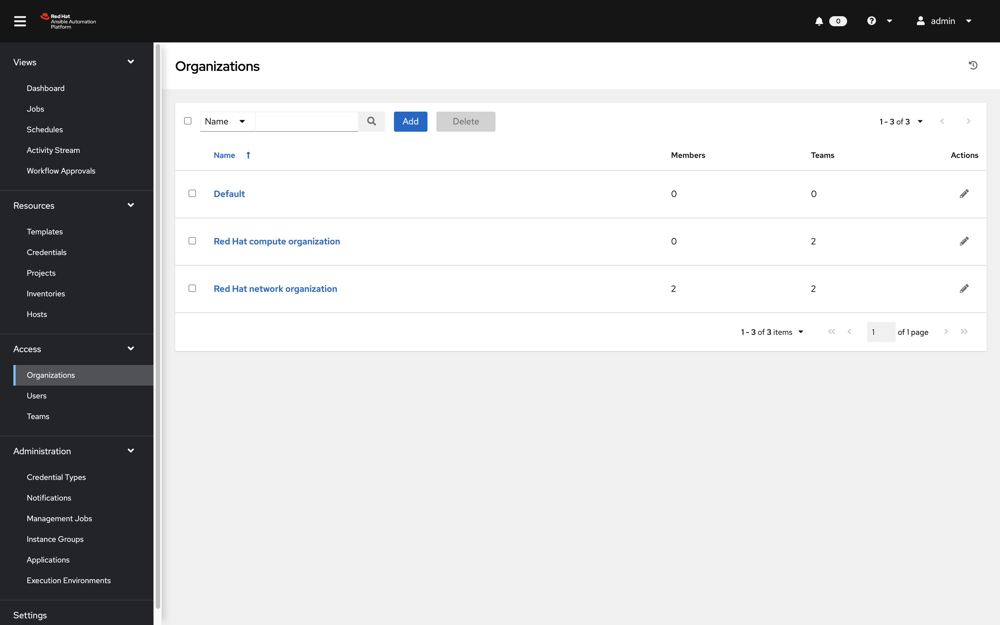
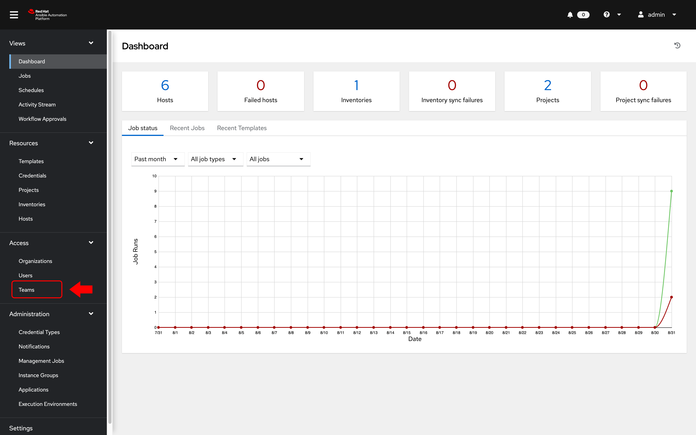
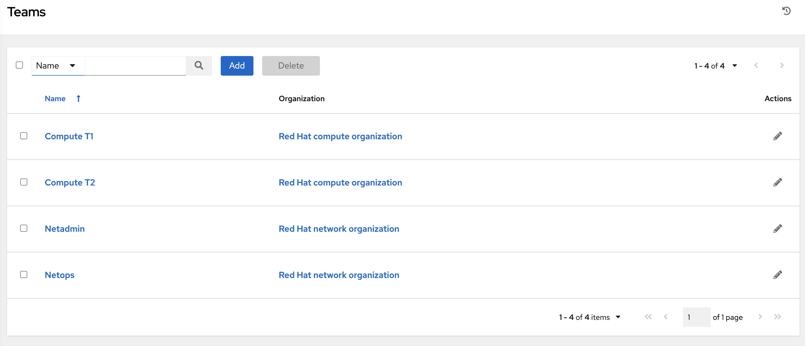
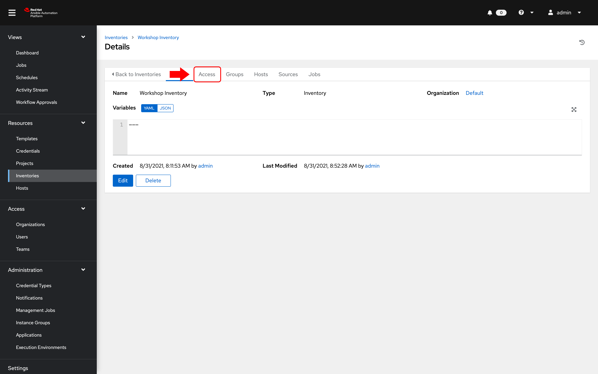

# Ejercicio 8: Understanding RBAC in controlador de Automatización

**Leálo en otros idiomas**:  [English](README.md),   [日本語](README.ja.md),  [Español](README.es.md).

## Índice

* [Objetivo](#objetivo)
* [Guía](#guía)
  * [Paso 1: Explorando las organizaciones](#Paso-1-explorando-las-organizaciones)
  * [Paso 2: Explorando las organizaciones de red](#Paso-2-explorando-las-organizaciones-de-red)
  * [Paso 3: Examinar los equipos](#Paso-3-examinar-los-equipos)
  * [Paso 4: Examinar los equipos de operaciones de red](#Paso-4-examinar-los-equipos-de-operaciones-de-red)
  * [Paso 5: Entrar como administrador de red](#Paso-5-entrar-como-administrador-de-red)
  * [Paso 6: Comprender los Roles de Equipo](#Paso-6-comprender-los-roles-de-equipo)
  * [Paso 7: Job Template Permissions](#Paso-7-job-template-permissions)
  * [Paso 8: Entrar como operador de red](#Paso-8-entrar-como-operador-de-red)
  * [Paso 9: Lauzar una plantilla de trabajo](#Paso-9-launching-a-job-template)
  * [Bonus](#bonus)
* [Consejos a recordar](#consejos-a-recordar)
* [Completado](#completado)

## Objetivo

Uno de los de usar el controlador de Automatización es el control sobre los usuarios que usan el sistema. El objetivo de este ejercicio es comprender el Control De Acceso Basado en Roles ([RBACs](https://docs.ansible.com/automation-controller/latest/html/userguide/security.html#role-based-access-controls)) con el que los administradores pueden definir proyectos, equipos, roles y asociar usuarios a esos roles. Esto les da a las organizaciones la posibilidad de asegurar la automatización del sistema y satisfacer los objetivos y requerimientos de conformidad.

## Guía

Observemos alguna terminología del controlador de Automatización:

* **Organizations:** Define un proyecto, como por ejemplo *Network-org*, *Compute-org*. Esto podría usarse para reflejar la estructura organizativa interna de la organización del cliente.
* **Teams:** Dentro de cada organización, pueden existir más de un equipo. Por ejemplo *tier1-helpdesk*, *tier2-support*, *tier3-support*, *build-team* etc.
* **Users:** Los usuarios típicamente pertenecen a equipos. Lo que el usuario puede hacer dentro del controlador de Automatización está controlado/definido mediante **roles**.
* **Roles:** Los roles definen qué acciones puede hacer un usuario. Esto se puede mapear claramente a organizaciones de red que tiene acceso restringido basado en si el usuario es una persona de soporte de Nivel-1, Nivel-2 o un administrador sénior. La [documentation](https://docs.ansible.com/automation-controller/latest/html/userguide/security.html#built-in-roles) del controlador de Automatización define un conjunto de roles pre establecidos.

### Paso 1: Explorando las organizaciones

* Entra al controlador de Automatización con el usuario **admin**.

  | Parameter | Value |
  |---|---|
  | username  | `admin`  |
  |  password|  provided by instructor |

* Confirma que has entrado como el usuario **admin**.

  

* Bajo la sección **Access**, haz click en **Organizations**

  Como el usuario *admin*, podrás ver todas las organizaciones configuradas en el  controlador de Automatización:

  <table>
  <thead>
    <tr>
      <th>Note: The orgs, teams and users were auto-populated for this workshop</th>
    </tr>
  </thead>
  </table>

* Examina las organizaciones

  Hay 2 organizaciones (además de la por defecto, Default):

  * **Red Hat compute organization**
  * **Red Hat network organization**

   

   <table>
   <thead>
     <tr>
       <th>Observa que esta página muestra un resumen de todos los equipos, usuarios, inventarios, proyectos y plantillas de trabajo asociadas con ellas. Si un administrador de nivel de organización se ha configurado, también se mostrará.</th>
     </tr>
   </thead>
   </table>

### Paso 2: Explorando las organizaciones de red

1. Haz click en **Red Hat network organization**.

   Se mostrará una sección que presenta los detalles de la organización.

   

2. Haz click en la pestaña **Access** para ver los usuarios asociados con esta organización.

   <table>
   <thead>
    <tr>
      <th>Observa que tanto el usuario <b>network-admin</b> como <b>network-operator</b> están asociados a esta organización.</th>
    </tr>
   </thead>
   </table>

### Paso 3: Examinar los equipos

1. Haz click en **Teams** en la barra lateral.

   

2. Examina los equipos. El administrador del controlador de Automatización podrá ver los equipos disponibles. Hay cuatro equipos:

   * Compute T1
   * Compute T2
   * Netadmin
   * Netops

   

### Paso 4: Examinar los equipos de operaciones de red

* Haz click el equipo **Netops** y luego Haz click en la pestaña **Access**. Observa dos usuarios en particular:

  * network-admin
  * network-operator

  

* Observa los siguientes dos puntos:

  * El usuario **network-admin** tiene privilegios de administrador para la **organización Red Hat network**
  * El usuario **network-operator** es un miembro del equipo Netops. Profundizaremos en ésto para entender los roles.

### Paso 5: Entrar como administrador de red

* Cierra la sesión del usuario admin haciendo click en el botón admin en la esquina superior derecha de la interfaz de usuario del controlador de Automatización:

   

* Entra al sistema con el usuario **network-admin**.

  | Parameter | Value |
  |---|---|
  | username  | network-admin  |
  |  password|  provided by instructor |

* Confirma que has entrado como el usuario **network-admin**.

  

* Haz click el link de la barra lateral **organizations**.

  Observarás que la visibilidad es la de la organización que estás administrando, **Red Hat network organización**.

  Las siguientes dos organizacionesre ya no son visibles:

  * Red Hat compute organización
  * Default

* Bonus: Repite los pasos como el usuario network-operator (misma password que network-admin).

   * ¿Qué diferencias observas entre network-operator y network-admin? 
   * Como operador de red, ¿eres capaz de ver otros usuarios?
   * ¿Eres capaz de añadir un usuario o de editar sus credenciales?

### Paso 6: Comprender los Roles de Equipo

1. Para comprender los diferentes roles, y por tanto, cómo se aplica el RBAC, cierra la sesión y entra otra vez como el usuario **admin**.

2. Navega hasta **Inventories** y haz click en  **Workshop Inventory**

3. Haz click en el botón **Access**

   

4. Examina los permisos asignados a cada usuario

   

   <table>
   <thead>
     <tr>
       <th>Nota: Observa los <b>ROLES</b> asignados para los usuarios <b>network-admin</b> y <b>network-operator</b>. Mediante el rol <b>Use</b>, el usuario <b>network-operator</b> ha obtenido permiso para ver este inventario en particular.</th>
     </tr>
   </thead>
   </table>

### Paso 7: Job Template Permissions

1. Haz click en el botón **Templates** en el menú de la izquierda

2. Haz click en la plantilla de trabajo **Network-Commands**

3. Haz click en el botón **Access** en la barra superior

   

   <table>
   <thead>
     <tr>
       <th>Nota: los mismos usuarios tienen roles diferentes para una plantilla de trabajo. Con esto se subraya la granularidad que los operadores pueden introducir con el controlador de Automatización para decidir "quién accede a qué". En este ejemplo, el usuario network-admin (<b>Admin</b>) puede actualizar la plantilla de trabajo <b>Network-Commands</b>, mientras que el que el network-operator sólo puede ejecutarlo, <b>Execute</b>.</th>
     </tr>
   </thead>
   </table>

### Paso 8: Entrar como operador de red

Y por fin, vamos a ver RBAC en acción.

1. Cierra la sesión de admin y vuelve a entrar como usuario **network-operator**.

   | Parameter | Value |
   |---|---|
   | username  | `network-operator`  |
   |  password|  provided by instructor |

2. Navega hasta **Templates** y haz click en la plantilla de trabajo **Network-Commands**.

   

   <table>
   <thead>
     <tr>
       <th>Observa que, como el usuario <b>network-operator</b>, no podrás cambiar ninguno de los campos. El botón <b>Edit</b> ya no aparecerá disponible.</th>
     </tr>
   </thead>
   </table>

### Paso 9: Lauzar una plantilla de trabajo

1. Lanza la plantilla **Network-Commands** haciendo click en el botón **Launch**.

2. Aparecerá un diálogo que te permitirá elegir uno de los comandos pre configurados:

   

3. Selecciona un comando y haz click **Next** y luego en **Launch** para ver la ejecución del playbook y su salida.

### Bonus

Si dispones de tiempo, vuelve a entrar como el usuario network-admin y añade otro comando que te gustaría que el operador pueda ejecutar. Así podrás ver cómo el rol *Admin* del usuario network-admin te permite editar o actualizar plantillas de trabajo.

## Consejos a recordar

* El uso de RBAC es una caracteristica poderosa del controlador de Automatización, como se puede observar, es fácil restringir acceso a operadores para ejecutar comandos en sistemas de producción sin que ello requiera acceso a dichos sistemas.
* El controlador de Automatización puede albergar múltiples organizaciones, múltiples equipos y usuarios. Los usuarios pueden incluso pertenecer a múltiples equipos y organizaciones, si es necesario. Algo que no hemos cubierto en este ejercicio es que no es necesario gestionar usuarios en el controlador de Automatización, simplemente, podemos utilizar un [servidor de autenticación empresarial](https://docs.ansible.com/automation-controller/latest/html/administration/ent_auth.html) incluyendo Active Directory, LDAP, RADIUS, SAML y TACACS+.
* En caso de necesitar una excepción (un usuario necesita acceso pero no su equipo completo) también es posible implementarlo. La granularidad de RBAC puede llegar hasta el nivel de credencial, inventario o plantilla de trabajo para un usuario particular.

## Completado

¡Felicidades, has completado el ejercicio de laboratorio 7!

---
[Ejercicio Anterior](../7-controller-survey/README.es.md) | [Próximo ejercicio](../9-controller-workflow/README.es.md)

[Haz click aquí para volver al taller Ansible Network Automation](../README.es.md)