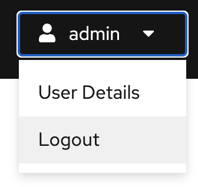
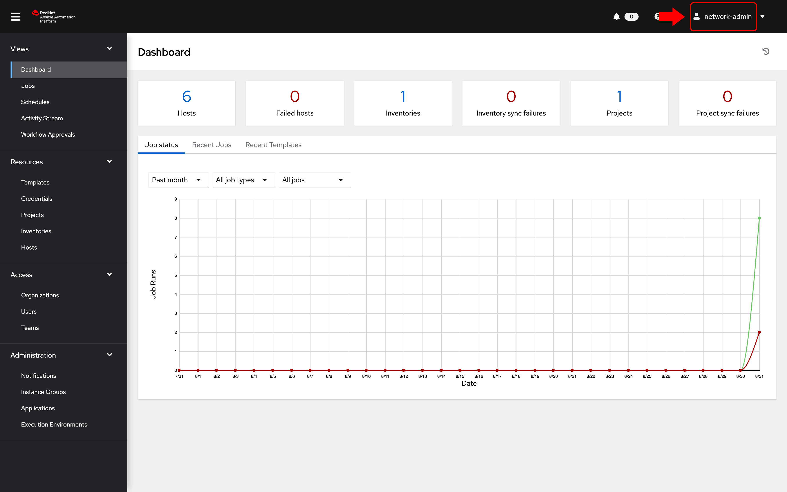
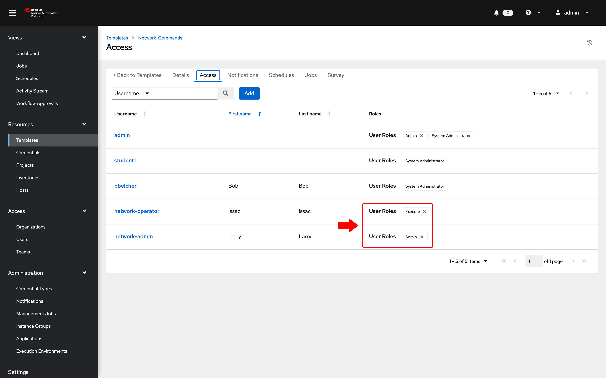
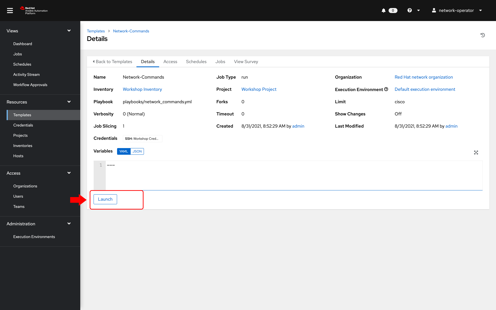
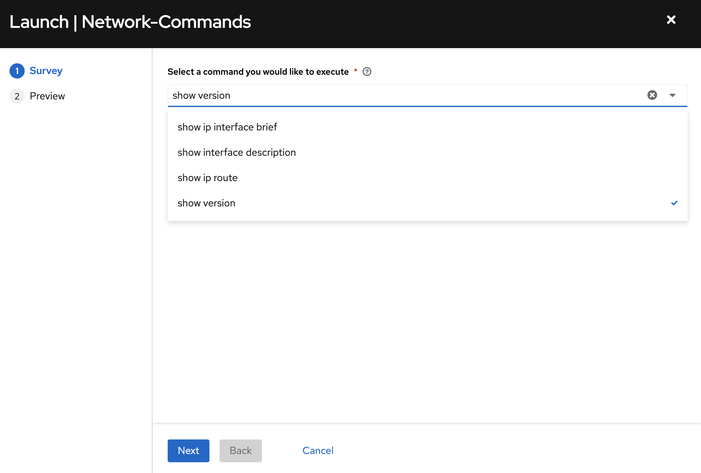

# Exercise 8: Understanding RBAC in controlador de Automatización

**Leálo en otros idiomas**:  [English](README.md),   [日本語](README.ja.md),  [Español](README.es.md).

## Índice

* [Objetivo](#objetivo)
* [Guía](#guía)
  * [Paso 1: Explorando las organizaciones](#Paso-1-explorando-las-organizaciones)
  * [Paso 2: Explorando las organizaciones de red](#Paso-2-explorando-las-organizaciones-de-red)
  * [Paso 3: Examinar los equipos](#Paso-3-examinar-los-equipos)
  * [Paso 4: Examinar los equipos de operaciones de red](#Paso-4-examinar-los-equipos-de-operaciones-de-red)
  * [Paso 5: Entrar como administrador de red](#Paso-5-entrar-como-administrador-de-red)
  * [Paso 6: Comprender los Roles de Equipo](#Paso-6-comprender-los-roles-de-equipo)
  * [Paso 7: Job Template Permissions](#Paso-7-job-template-permissions)
  * [Paso 8: Entrar como operador de red](#Paso-8-entrar-como-operador-de-red)
  * [Paso 9: Lauzar una plantilla de trabajo](#Paso-9-launching-a-job-template)
  * [Bonus](#bonus)
* [Consejos a recordar](#consejos-a-recordar)
* [Completado](#completado)

## Objetivo

Uno de los de usar el controlador de Automatización es el control sobre los usuarios que usan el sistema. El objetivo de este ejercicio es comprender el Control De Acceso Basado en Roles ([RBACs](https://docs.ansible.com/automation-controller/latest/html/userguide/security.html#role-based-access-controls)) con el que los administradores pueden definir proyectos, equipos, roles y asociar usuarios a esos roles. Esto les da a las organizaciones la posibilidad de asegurar la automatización del sistema y satisfacer los objetivos y requerimientos de conformidad.

## Guía

Observemos alguna terminología del controlador de Automatización:

* **Organizations:** Define un proyecto, como por ejemplo *Network-org*, *Compute-org*. Esto podría usarse para reflejar la estructura organizativa interna de la organización del cliente.
* **Teams:** Dentro de cada organización, pueden existir más de un equipo. Por ejemplo *tier1-helpdesk*, *tier2-support*, *tier3-support*, *build-team* etc.
* **Users:** Los usuarios típicamente pertenecen a equipos. Lo que el usuario puede hacer dentro del controlador de Automatización está controlado/definido mediante **roles**.
* **Roles:** Los roles definen qué acciones puede hacer un usuario. Esto se puede mapear claramente a organizaciones de red que tiene acceso restringido basado en si el usuario es una persona de soporte de Nivel-1, Nivel-2 o un administrador sénior. La [documentation](https://docs.ansible.com/automation-controller/latest/html/userguide/security.html#built-in-roles) del controlador de Automatización define un conjunto de roles pre establecidos.

### Paso 1: Explorando las organizaciones

* Entra al controlador de Automatización con el usuario **admin**.

  | Parameter | Value |
  |---|---|
  | username  | `admin`  |
  |  password|  provided by instructor |

* Confirma que has entrado como el usuario **admin**.

  

* Bajo la sección **Access**, haz click en **Organizations**

  Como el usuario *admin*, podrás ver todas las organizaciones configuradas en el  controlador de Automatización:

  <table>
  <thead>
    <tr>
      <th>Note: The orgs, teams and users were auto-populated for this workshop</th>
    </tr>
  </thead>
  </table>

* Examina las organizaciones

  Hay 2 organizaciones (además de la por defecto, Default):

  * **Red Hat compute organization**
  * **Red Hat network organization**

   

   <table>
   <thead>
     <tr>
       <th>Observa que esta página muestra un resumen de todos los equipos, usuarios, inventarios, proyectos y plantillas de trabajo asociadas con ellas. Si un administrador de nivel de organización se ha configurado, también se mostrará.</th>
     </tr>
   </thead>
   </table>

### Paso 2: Explorando las organizaciones de red

1. Haz click en **Red Hat network organization**.

   Se mostrará una sección que presenta los detalles de la organización.

   

2. Haz click en la pestaña **Access** para ver los usuarios asociados con esta organización.

   <table>
   <thead>
    <tr>
      <th>Observa que tanto el usuario <b>network-admin</b> como <b>network-operator</b> están asociados a esta organización.</th>
    </tr>
   </thead>
   </table>

### Paso 3: Examinar los equipos

1. Haz click en **Teams** en la barra lateral.

   

2. Examina los equipos. El administrador del controlador de Automatización podrá ver los equipos disponibles. Hay cuatro equipos:

   * Compute T1
   * Compute T2
   * Netadmin
   * Netops

   

### Paso 4: Examinar los equipos de operaciones de red

* Haz click on the **Netops** Team and then Haz click on the **Access** tab. Take note  to two particular users:

  * network-admin
  * network-operator

  

* Observe the following two points:

  * The **network-admin** user has administrative privileges for the **Red Hat network organización**
  * The **network-operator** is simply a member of the Netops team. We will dive into each of these users to understand the roles

### Paso 5: Entrar como administrador de red

* Log out from the admin user by Haz clicking the admin button in the top right corner of the controlador de Automatización UI:

   

* Entra to the system with the **network-admin** user.

  | Parameter | Value |
  |---|---|
  | username  | network-admin  |
  |  password|  provided by instructor |

* Confirm that you are logged in as the **network-admin** user.

  

* Haz click on the **organizacións** link on the sidebar.

  You will notice that you only have visibility to the organización you are an admin of, the **Red Hat network organización**.

  The following two organizacións are not seen anymore:

  * Red Hat compute organización
  * Default

* Bonus Paso: Try this as the network-operator user (same password as network-admin).

   * What is the difference between network-operator and network-admin?
   * As the network operator are you able to view other users?
   * Are you able to add a new user or edit user credentials?

### Paso 6: Comprender los Roles de Equipo

1. To understand how different roles and therefore RBACs may be applied, log out and log back in as the **admin** user.

2. Navigate to **Inventories** and Haz click on the  **Workshop Inventory**

3. Haz click on the **Access** button

   

4. Examine the permissions assigned to each user

   

   <table>
   <thead>
     <tr>
       <th>Note: <b>ROLES</b> assigned for the <b>network-admin</b> and <b>network-operator</b> users. By assigning the <b>Use</b> Role, the <b>network-operator</b> user has been granted permission to use this particular inventory.</th>
     </tr>
   </thead>
   </table>

### Paso 7: Job Template Permissions

1. Haz click on the **Templates** button in the left menu

2. Haz click on the **Network-Commands** Job Template

3. Haz click on the **Access** button at the top

   

   <table>
   <thead>
     <tr>
       <th>Note: the same users have different roles for the job template. This highlights the granularity operators can introduce with controlador de Automatización in controlling "Who gets access to what". In this example, the network-admin can update (<b>Admin</b>) the <b>Network-Commands</b> job template, whereas the network-operator can only <b>Execute</b> it.</th>
     </tr>
   </thead>
   </table>

### Paso 8: Entrar como operador de red

Finally, to see the RBAC in action!

1. Log out at admin and log back in as the **network-operator** user.

   | Parameter | Value |
   |---|---|
   | username  | `network-operator`  |
   |  password|  provided by instructor |

2. Navigate to **Templates** and Haz click on the **Network-Commands** Job Template.

   

   <table>
   <thead>
     <tr>
       <th>Note that, as the <b>network-operator</b> user, you will have no ability to change any of the fields.  The <b>Edit</b> button is no longer available.</th>
     </tr>
   </thead>
   </table>

### Paso 9: Lauzar una plantilla de trabajo

1. Launch the **Network-Commands** template by Haz clicking on the **Launch** button:

4. You will be prompted by a dialog-box that lets you choose one of the pre-configured show commands.

   

5. Go ahead and choose a command and Haz click **Next** and then **Launch** to see the playbook being executed and the results being displayed.

### Bonus

If time permits, log back in as the network-admin and add another show command you would like the operator to run. This will also help you see how the *Admin* Role of the network-admin user allows you to edit/update the job template.

## Consejos a recordar

* Using controlador de Automatización's powerful RBAC feature, you can see it is easy to restrict access to operators to run prescribed commands on production systems without requiring them to have access to the systems themselves.
* controlador de Automatización can support multiple organizacións, multiple Teams and users.  Users can even belong to multiple Teams and organizacións if needed.  Something not covered in this exercise is that we do not need to manage users in controlador de Automatización, we can use [enterprise authentication](https://docs.ansible.com/automation-controller/latest/html/administration/ent_auth.html) including Active Directory, LDAP, RADIUS, SAML and TACACS+.
* If there needs to be an exception (a user needs access but not his entire team) this is also possible.  The granularity of RBAC can be down to the credential, inventory or Job Template for an individual user.

## Complete

You have completed lab exercise 8

---
[Previous Exercise](../7-controller-survey/) | [Next Exercise](../9-controller-workflow/README.md)

[Haz click here to return to the Ansible Network Automation Workshop](../README.md)
