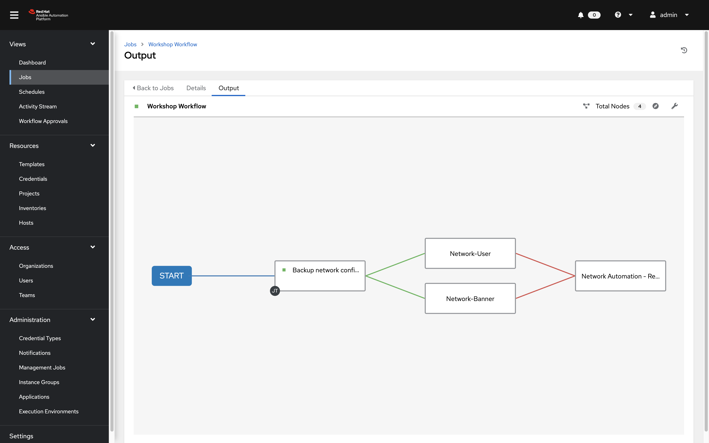

# 演習 9: ワークフローの作成

**他の言語でもお読みいただけます**:  [English](README.md)、 [日本語](README.ja.md)

## 目次

* [目的](#objective)
* [ガイド](#guide)
  * [ステップ 1: ワークフローテンプレートの作成](#step-1-create-a-workflow-template)
  * [ステップ 2: ワークフロービジュアライザー](#step-2-the-workflow-visualizer)
  * [ステップ 3:
    バナージョブテンプレートの設定の追加](#step-3-add-the-configure-banner-job-template)
  * [ステップ 4:
    ネットワークユーザージョブテンプレートの設定の追加](#step-4-add-the-configure-network-user-job-template)
  * [ステップ 5:
    ネットワーク復元ジョブテンプレートの追加](#step-5-add-the-network-restore-job-template)
  * [ステップ 6: コンバージドリンクの作成](#step-6-create-a-converged-link)
  * [ステップ 7: ワークフローの実行](#step-7-run-the-workflow)
* [重要なこと](#takeaways)
* [完了](#complete)

## 目的

[自動コントローラーワークフロー](https://docs.ansible.com/automation-controller/latest/html/userguide/workflows.html)
の使用法を示します。ワークフローを使用すると、インベントリー、プレイブック、またはパーミッションを共有する場合と共有しない場合がある、一連の異なるジョブテンプレート
(またはワークフローテンプレート) を構成できます。

この演習では、タイムスタンプ付きのバックアップを作成します。バックアップジョブが正常に完了すると、ワークフローはバナーとユーザーを同時に構成します。いずれかのジョブテンプレートが失敗した場合は、タイムスタンプ付きのバックアップに復元します。

## ガイド

### ステップ 1: ワークフローテンプレートの作成

1. **admin** ユーザーとしてログインしていることを確認してください。

2. 左側のメニューの **テンプレート** リンクをクリックします。

3. 青い Add ボタンをクリックして、**Add workflow template** を選択します。

   

4. 次のようにフォームに記入します。

   | Parameter | Value |
   |---|---|
   | Name  | Workshop Workflow  |
   |  Organization |  Default |
   |  Inventory |  Workshop Inventory |

5. 青い **Save** ボタンをクリックします

### ステップ 2: ワークフロービジュアライザー

1. **Save** をクリックすると、**ワークフロービジュアライザー** が自動的に開きます。そうでない場合は、**Visualizer**
   をクリックしてください。

   

2. デフォルトでは、緑色の **Start** ボタンのみが表示されます。**Start** ボタンをクリックします。

3. **Add Node** ウィンドウが表示されます。

  * ノードタイプを `Job Template` に設定します。

  * 演習 6 で作成した `Backup` ジョブテンプレートを選択します。

   

  * 青い **Save** ボタンをクリックします

  <table>
  <thead>
    <tr>
      <th><b>Backup network configurations</b> ジョブテンプレートがノードとなりました。ジョブまたはワークフローテンプレートは、ノードと呼ばれるグラフのような構造を使って相互に連携します。これらのノードには、承認、ジョブ、プロジェクト同期、インベントリー同期、または他のワークフローも含まれます。テンプレートは異なるワークフローの一部となることも、同じワークフローで複数回使用することもできます。</th>
    </tr>
  </thead>
  </table>

   

### ステップ 3: バナージョブテンプレートの設定の追加

1. *Backup network configurations* ノードにカーソルを合わせ、**+** 記号をクリックします。**Add
   Node** ウィンドウが再び表示されます。

2.  **Run type** については、ドロップダウンメニューから **On Success** を選択します。青い **Next**
    ボタンを押します。

   

   <table>
   <thead>
     <tr>
       <th>ワークフローは、前のノードが成功または失敗した場合に自動化ジョブを実行するように設定したり、前のジョブの状況に関わらず、必ず自動化ジョブを実行するように設定したりできます。これにより、ワークフローは問題を修正したり、デバイスの状態を元に戻したりすることができます。
       </th>
     </tr>
   </thead>
   </table>

3. **Network-Banner** ジョブテンプレートを選択します。

   

   * 青い **Next** ボタンをクリックします

4. 演習 7 と同様の Survey に記入します。

   

5. Next をクリックし、続いて Save をクリックします。

4. **Backup network configurations** と **Configure Banner**
   の間に緑色の線が存在する必要があります

   

### ステップ 4: ネットワークユーザージョブジョブテンプレートの設定の追加

1. *Backup network configurations* ノード (**Configure Banner** ノードではない)
   にカーソルを合わせ、**+** 記号をクリックします。**Add Node** が再び表示されます。

2.  **Run type** については、ドロップダウンメニューから **On Success** を選択します。青い **Next**
    ボタンを押します。

   

3. **Network-User** ジョブテンプレートを選択します。

   

4. Survey に記入します（または、デフォルトで `ansible` ユーザーを設定するようにします）

5. **Next** および **Save** をクリックします。

   

### ステップ 5: ネットワーク復元ジョブテンプレートの追加

1. **Network-Banner** ノードにカーソルを合わせ、**+** 記号をクリックします。**Add Node**
   ウィンドウが再び表示されます。

2. Run type に **On Failure** を選択します。

   

   * Next をクリックします。

3. **Network-Restore** ジョブテンプレートを追加します。

   

4. ロールバックの日付を選択し、**Next** および **Save** をクリックします。

   

### ステップ 6: コンバージドリンクの作成

1. **Network-User** ノードにカーソルを合わせ、**chain** 
   記号をクリックします。

2. 次に、既存の **Network-Restore** をダブルクリックします。**Add Link** ウィンドウが表示されます。**RUN**
   パラメーターには、**On Failure** を選択します。

   

   *  保存をクリックします。

3. ワークフローは、以下のようになります。

   

4. Save をクリックしてビジュアライザーを終了します。

### ステップ 7: ワークフローの実行

1. Launch ボタンをクリックします。

   

2. **Workshop Workflow** を確認します。

   

   ワークフロージョブ中はいつでも、ノードをクリックしてステータスを確認することにより、個々のジョブテンプレートを選択できます。

## 重要なこと

以下を行いました。

* バックアップを作成し、すべてのネットワークノードのユーザーとバナーの作成を試行するワークフローテンプレートを作成しました
* ワークフローを堅牢にしました。いずれかのジョブテンプレートが失敗した場合、指定されたバックアップに復元します
* ワークフローテンプレートを起動し、**ワークフロービジュアライザー** を調べました。

## 完了

ラボ演習 9 を完了しました。これでネットワーク自動化ワークショップは終了です。ご参加いただきありがとうございました!

追加の演習については、[追加の演習](../supplemental/README.md) を参照してください。

---
[前の演習](../8-controller-rbac/README.md)

[Click here to return to the Ansible Network Automation
Workshop](../README.md)
