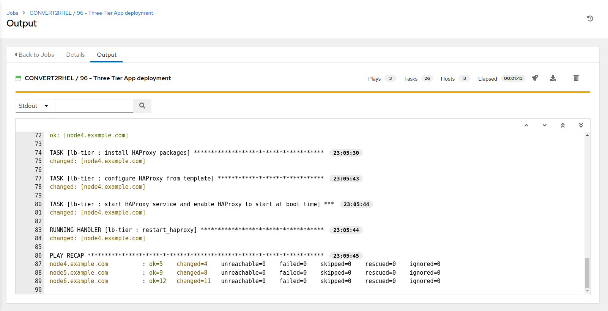
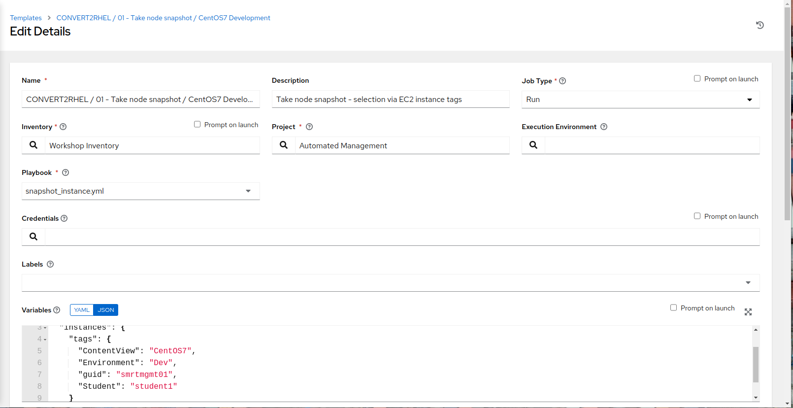
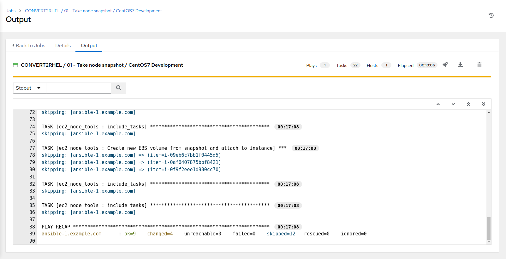
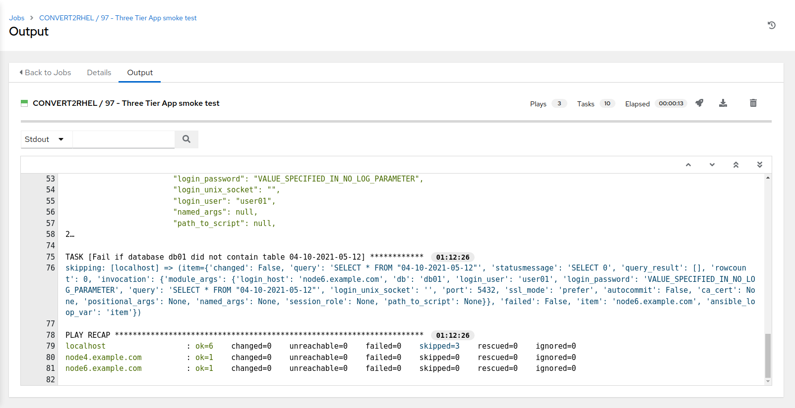
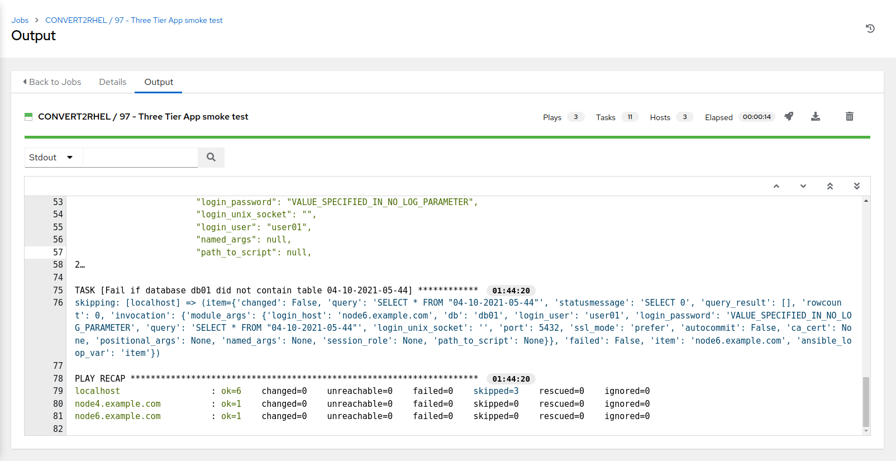
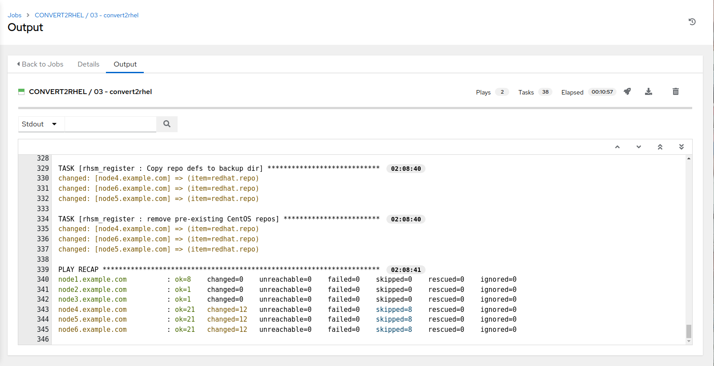
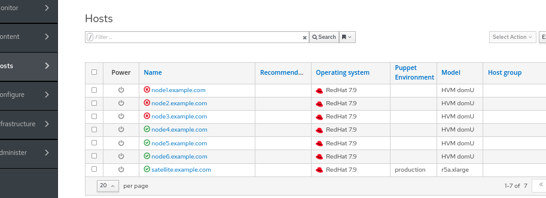
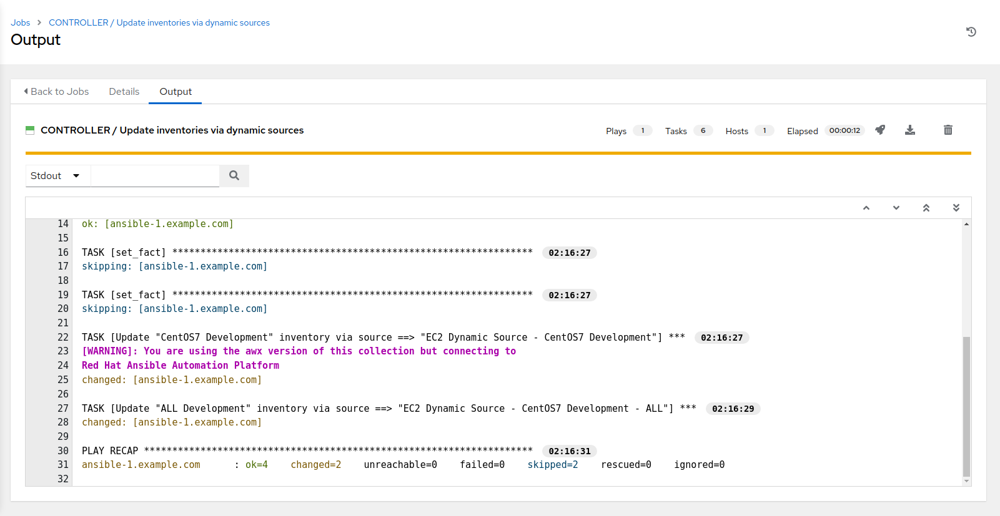
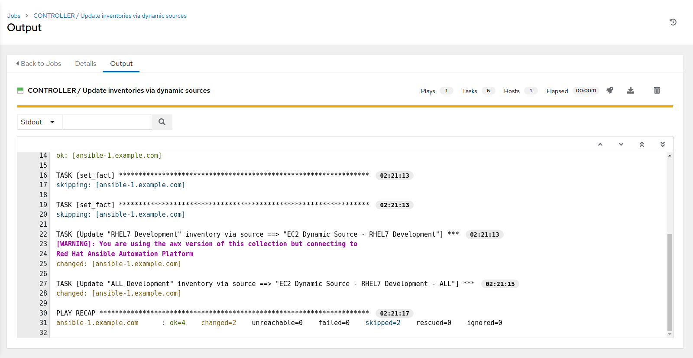
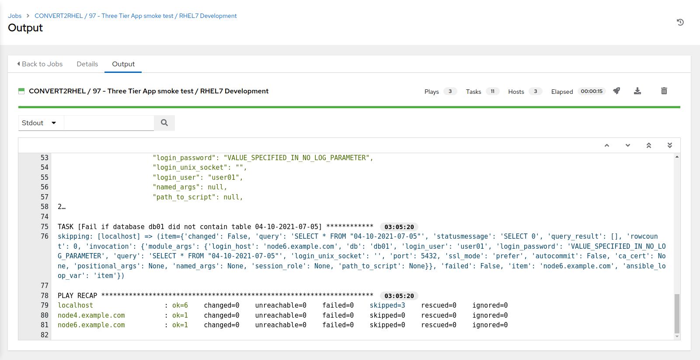

Automated Smart Management Workshop: CentOS/RHEL migration and upgrade
----------------------------------------------------------------------

**Introduction** 
This use-case will focus on conversion from CentOS (though this could be another RHEL derivitive) to RHEL while maintaining a 3 tier application stack (do no harm). While we only show this process for a few systems, it can be scaled to a larger number of physical, virtual or cloud hosts using content repos provided by [Red Hat Satellite](https://www.redhat.com/en/technologies/management/satellite) (included in [Red Hat Smart Management](https://www.redhat.com/en/technologies/management/smart-management)). The conversion process will be driven with automation built and run using [Ansible Automation Platform](https://www.redhat.com/en/technologies/management/ansible).

**Environment**
- Satellite 6.x, Ansible Automation Platform 4.x
- 3x CentOS 7 instances
- 3x RHEL 7  instances

**Exercise Scenario**
- Exercise: Convert CentOS 7 to RHEL 7

Overview
-----------------------------------------------------------------

**Summary** 
- Remember, during initial environment setup, we created a backup of the instance data (in case a fallback or restore is needed. Better safe than sorry.)
- We will utilize an additional project in Ansible Automation Platform, "Three Tier App / Dev", which will allow us to install (take a guess) a three tier application stack across the three CentOS nodes. Additionally, the project also provides a means to test/verify functionality of the application components, which we will perform pre RHEL conversion.
- Next, we employ the Convert2RHEL utility to convert the CentOS nodes to RHEL. There are many sources of information on this handy utility, here are several of note:
    - [How to convert from CentOS or Oracle Linux to RHEL](https://access.redhat.com/articles/2360841) (Jan 2021)
    - [Converting from CentOS to RHEL with Convert2RHEL and Satellite](https://www.redhat.com/en/blog/converting-centos-rhel-convert2rhel-and-satellite) (March 2020)
    - [Convert2RHEL: How to update RHEL-like systems in place to subscribe to RHEL](https://www.redhat.com/en/blog/convert2rhel-how-update-rhel-systems-place-subscribe-rhel) (Jan 2020)
- Verify functionality of the application stack post RHEL conversion.

Things to consider if doing this in dev/test/stage-beta/prod:
- Commercial and/or in-house developed application version(s) support with the host OS
- Bootloader changes
- Network connection and network time synchonizations

| **A Note about using Satellite vs. Ansible Automation Platform for this...**   |
| ------------- |
| Out of the box, Satellite 6 supports [RHEL systems roles](https://access.redhat.com/articles/3050101) (a collection of Ansible Roles) for a limited set of administration tasks. Satellite can be used to do OS conversions and upgrades, however an Ansible Automation Platform Subscription is required to execute complicated OS conversions and upgrades that require logic to meet up-time requirements.  Using these two solutions together ensures you have the best tool for the job for: - Content Management (Satellite) - OS Patching & Standardized Operating Environments (Satellite) - Provisioning: OS, Infra Services and Applications/Other (Satellite and/or Ansible Automation Platform) - Configuration of Infra and Apps (Ansible Automation Platform)  Reference: [Converting CentOS to RHEL with Red Hat Satellite 6](https://www.redhat.com/en/blog/steps-converting-centos-linux-convert2rhel-and-red-hat-satellite) and [Leapp Upgrade with Satellite 6](https://www.redhat.com/en/blog/leapp-upgrade-using-red-hat-satellite-6)|

Ok, let's get started...  

Pre-requisites
--------------

-   Exercise 0: Lab Setup

-   Organization to be used = Default Organization

-   Location to be used = Default Location

-   A content view = RHEL7

-   Lifecycle environments = Dev, QA, Prod

Exercise:
-----------------------------------------------------------------
**Login to your Satellite & AAP UI's**
> **NOTE** The following are *example* URLs. Your student lab URLs will be different.
* Ansible Automation Platform URL 
    Example: https://student1.{random}.example.opentlc.com*
* Satellite URL 
    Example: https://student1-sat.{random}.example.opentlc.com (Note the -sat added to the URL)*

Note that in the following steps that are being performed on AAP, at any time, over on the Satellite console, review the registered hosts via clicking Hosts => All Hosts.  Refresh the Hosts page to see changes as they occur a result from the automation being performed via AAP.

**Steps:** 
#### 1\. Logging into the Ansible Automation Platform (AAP)

-   Use a web browser on your computer to access the AAP GUI via the link found in the Environment above. And use the following username and password to login: *admin / <password_set_in_deploy_vars>*

-   Upon successful login, you will be able to see the Ansible Automation Platform dashboard.

#### 2\. Install Three Tier Application Stack

-   Use the side pane menu on the left to select **Templates**.

-   Click  to the right of **CONVERT2RHEL / 96 - Three Tier App deployment** to launch the job.  This will take ~2 minutes to complete.

#### 3\. Take CentOS node snapshot (optional, however, recommended for this exercise)

-   Use the side pane menu on the left to select **Templates**.

-   Click  to the right of **CONVERT2RHEL / 01 - Take node snapshot** to copy the template.

-   Click the newly created job template **CONVERT2RHEL / 01 - Take node snapshot @ some-timestamp**

-   Click **Edit** at the bottom left.
    - Edit the name to **CONVERT2RHEL / 01 - Take node snapshot / CentOS7 Development**
    - In the **Variables** section, within *tags* remove:

    "short_name": "node*",

    ...and add:

    "ContentView": "CentOS7",

    "Environment": "Dev",

- Review the changes, then at the bottom left, click **Save**
- Verify the template name change, as well as the tag adjustments in the **Variables** section then click **Launch**
- Selecting launch will take you to the **Jobs > CONVERT2RHEL / 01 - Take node snapshot / CentOS7 Development** output window where you will be able to follow each task executed as part of the playbook. This will take approximately 5 mins to complete.

#### 4\. Verify three tier application functionality on CentOS nodes - pre Centos update

- Use the side pane menu on the left to select **Templates**.

- Click  to the right of **CONVERT2RHEL / 97 - Three Tier App smoke test** to launch the job.
- Selecting launch will take you to the **Jobs > CONVERT2RHEL / 97 - Three Tier App smoke test** output window where you will be able to follow each task executed as part of the playbook. This will take approximately 30 secs to complete.

#### 5\. Upgrade CentOS nodes to latest version

- Use the side pane menu on the left to select **Templates**.

- Click  to the right of **CONVERT2RHEL / 02 - Upgrade OS to latest release** to launch the job.

- Selecting launch will take you to the **Jobs > CONVERT2RHEL / 02 - Upgrade OS to latest release** output window where you will be able to follow each task executed as part of the playbook. This will take approximately 6 mins to complete.

#### 6\. Verify three tier application functionality on CentOS nodes - post Centos update, pre Convert2RHEL

- Use the side pane menu on the left to select **Templates**.

- Click to the right of **CONVERT2RHEL / 97 - Three Tier App smoke test** to launch the job.

- Selecting launch will take you to the **Jobs > CONVERT2RHEL / 97 - Three Tier App smoke test** output window. This will take approximately 30 secs to complete.

#### 7\. Convert2RHEL - CentOS7 Development nodes to RHEL7 Development nodes

-   Use the side pane menu on the left to select **Templates**.

-   Click  to the right of **CONVERT2RHEL / 03 - convert2rhel** to launch the job.

      - choose LE group to convert CentOS7_Dev
      - choose LE target RHEL7_Dev

- Selecting launch will take you to the **Jobs > CONVERT2RHEL / 03 - convert2rhel** output window. This will take approximately 11 mins to complete.

> **NOTE** with some pre-configuration, any combination is possible

- click **Next** to continue

- confirm CentOS and RHEL LE variables set via survey selections and click **Launch**

If you look in Satellite now (**Hosts > All Hosts**), you will see that all CentOS notes have been converted to RHEL 7.9 nodes.

#### 8\. Query Satellite to get post conversion node-related details, set EC2 instance tags based on these details
-   Use the side pane menu on the left to select **Templates**.

-   Click  to the right of **EC2 / Set instance tags based on Satellite(Foreman) facts** to launch the job.

- Selecting launch will take you to the **Jobs > EC2 / Set instance tags based on Satellite(Foreman) facts** output window. This will take approximately 30 secs to complete.

#### 9\. Update inventories via dynamic sources
-   Use the side pane menu on the left to select **Templates**.

-   Click  to the right of **CONTROLLER / Update inventories via dynamic sources** to launch the job.
    - Select "CentOS7" for Inventory To Update
    - Select "Dev" for Choose Environment
    - Click **Next**, confirm prompted values, then click **Launch**
    - Selecting launch will take you to the **Jobs > CONTROLLER / Update inventories via dynamic sources** output window. This will take approximately 30 secs to complete.

-   Use the side pane menu on the left to select **Templates**.

-   Click  to the right of **CONTROLLER / Update inventories via dynamic sources** to launch the job.
    - template CONTROLLER / Update inventories via dynamic sources
    - Select "RHEL7" for Inventory To Update
      - select "Dev" for Choose Environment
      - Click **Next**, confirm prompted values, then click **Launch**
    - Selecting launch will take you to the **Jobs > CONTROLLER / Update inventories via dynamic sources** output window. This will take approximately 30 secs to complete.
    

    - If you look in **Inventories > RHEL7 Development** you will now see that nodes[1-6] are in the inventory.
      

#### 10\. Create a converted RHEL credential
-   Use the side pane menu on the left to select **Credentials**.
-   Click  to the right of **Workshop Credential** to copy the credential.

-   Click the newly created credential **Workshop Credential @ some-timestamp**

-   Click **Edit** at the bottom left.
    - Edit the name to **Converted RHEL Credential**
    - Change the username from "ec2-user" to "centos"

-   Click **Save**

#### 11\. Copy template CONVERT2RHEL / 97 - Three Tier App smoke test to template CONVERT2RHEL / 97 - Three Tier App smoke test / RHEL7 Development
-   Use the side pane menu on the left to select **Templates**.

-   Click  to the right of **CONVERT2RHEL / 97 - Three Tier App smoke test** to copy the template.

-   Click the newly created job template **CONVERT2RHEL / 97 - Three Tier App smoke test @ some-timestamp**

-   Click **Edit** at the bottom left.
    - Edit the name to **CONVERT2RHEL / 97 - Three Tier App smoke test / RHEL7 Development**
    - Click  under Inventory and select the radio button for **RHEL7 Development**, followed by **Select**.
    - Click  under Credentials and select the radio button for **Converted RHEL Credential**, followed by **Select**.
    - Review the changes, then scroll down and on the bottom left, click **Save**
    - Click **Launch** to run the new job template **CONVERT2RHEL / 97 - Three Tier App smoke test / RHEL7 Development**
    - Selecting launch will take you to the **Jobs > CONVERT2RHEL / 97 - Three Tier App smoke test / RHEL7 Development** output window. This will take approximately 30 secs to complete.

The Three Tier App smoke test template should have completed successfully, which shows that we were able to complete the migration from CentOS 7 to RHEL 7, and when that process finished, our 3 tier application still functioned.

> **EXTRA CREDIT - Convert2RHEL workflow template**
Create a workflow template incorporating the above standalone templates into a complete CentOS to RHEL conversion workflow!

>**EXTRA CREDIT - Infrastructure-as-Code "Choose Your Own Adventure"**
  - Fork Automated Smart Management repo to individual GitHub account
Before we begin, you'll need to fork the Automated Smart Management repo into your personal GitHub account.  If you do not have an individual GitHub account, you will need to create one to proceed. Utilization of a source code management (SCM) system is central to the "infrastructure as code" concepts put forth in this lab exercise, and in this case, GitHub is our SCM.

Once logged into [GitHub](https://github.com) navigate to the [Red Hat Partner Tech repo for Automated Smart Management](https://github.com/redhat-partner-tech/automated-smart-management) repo. Next, on the Automated Smart Management repo page, in the top, upper right of the page, click "Fork".  This will create a "forked" Automated Smart Management repo in your personal GitHub account.

[Switch the "Automated Management" project in AAP to utilize your newly cloned repo](https://github.com/your-github-username/automated-smart-management.git). The following files are some good places to start looking to see where you can adjust the Extra Vars instance tags to select/filter what particular instances that a job template/playbook gets run against:

`group_vars/control/inventories.yml`

`group_vars/control/job_templates.yml`

Once the updates are made, commit and push these changes to the cloned repo, followed by running the "SETUP / Controller" job template, which will propogate the changes to AAP itself.
...
