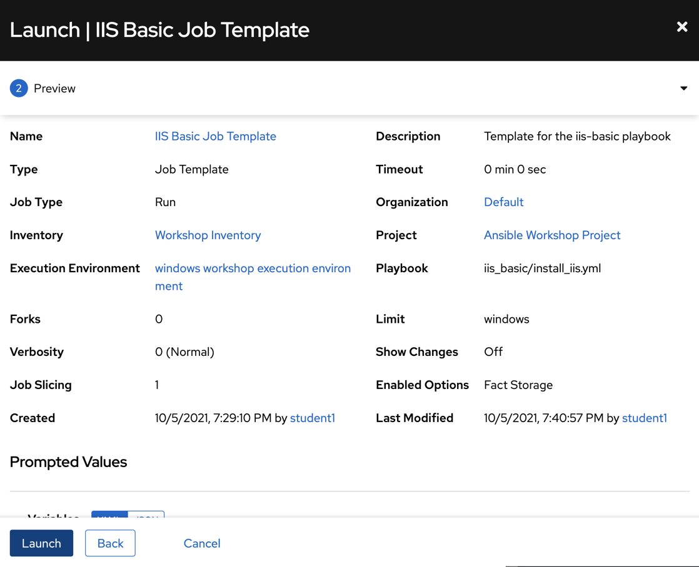

**Lisez ceci dans d'autres langues**:
  [English](README.md),  [日本語](README.ja.md),  [Française](README.fr.md).

Un modèle est une définition et un ensemble de paramètres permettant d'exécuter une tache Ansible. Les modèles sont utiles pour exécuter plusieurs fois la même tache.

Synchroniser votre projet
=========================

Avant de pouvoir créer un modèle avec un nouveau playbook, vous devez d'abord synchroniser votre projet pour que Controller en soit informé. Pour ce faire, cliquez sur **Projets**, puis cliquez sur l'icône de synchronisation à côté de votre projet. Une fois cette opération terminée, vous pourrez créer le modèle.

Création d'un modèle de tâche
=============================

Étape 1:
--------

Selectionner **Modèles**

Étape 2:
--------

Cliquez sur l'icone , et selectionnez `Modèle de tache`

Étape 3:
--------

Remplissez le formulaire en utilisant les valeurs suivantes

| Clé         | Valeur                                       | Note |
|-------------|----------------------------------------------|------|
| Name        | IIS Basic Job Template                       |      |
| Description | Template for the iis-basic playbook          |      |
| JOB TYPE    | Run                                          |      |
| INVENTORY   | Workshop Inventory                   |      |
| PROJECT     | Ansible Workshop Project                     |      |
| PLAYBOOK    | `iis-basic/install_iis.yml`                  |      |
| CREDENTIAL  | Type: **Machine**. Name: **Student Account** |      |
| LIMIT       | windows                                      |      |
| OPTIONS     | [*] ENABLE FACT CACHE                        |      |

Étape 4:
--------

Cliquez sur `ENREGISTRER`  puis sélectionnez `Ajouter un qustionnaire`

Étape 5:
--------

Remplissez le formulaire avec les valeurs suivantes

| Clé                    | Valeur                                                     | Note             |
|------------------------|------------------------------------------------------------|------------------|
| PROMPT                 | Please enter a test message for your new website           |                  |
| DESCRIPTION            | Website test message prompt                                |                  |
| ANSWER VARIABLE NAME   | `iis_test_message`                                         |                  |
| ANSWER TYPE            | Text                                                       |                  |
| MINIMUM/MAXIMUM LENGTH |                                                            | Use the defaults |
| DEFAULT ANSWER         | *Be creative, keep it clean, we’re all professionals here* |                  |

Étape 6:
--------

Selectionnez `ADD` 

Étape 7:
--------

Selectionnez `ENREGISTRER` 

Étape 8:
--------

De retour sur la page principale du modèle de travail, sélectionnez ENREGISTRER
 again.

Lancer une tâche
================

Maintenant que vous avez créé votre modèle de travail avec succès, vous êtes prêt à le lancer. Une fois que vous le faites, vous serez redirigé vers un écran de tâche qui est rafraîchissant en temps réel et vous montre l'état de la tâche.

Étape 1:
--------

Sélectionnez `MODÈLES`

> **Remarque**
> Alternativement, si vous n'avez pas quitté la page de création de modèles de travail, vous pouvez faire défiler vers le bas pour voir tous les modèles de travail existants

Étape 2:
--------

Cliquez sur l'icône de la fusée  pour le modèle **IIS Basic Job Template**

Étape 3:
--------

Lorsque vous y êtes invité, entrez le message de test souhaité

Étape 4:
--------

Sélectionnez **SUIVANT** et prévisualisez les entrées.

Étape 5:
--------

Sélectionnez LANCER 

Étape 6:
--------

Asseyez-vous, regardez la magie se produire

L'une des premières choses que vous remarquerez est la section récapitulative. Cela vous donne des détails sur votre travail, tels que qui l'a lancé, quel playbook est exécuté, et quel est son statut (soit en attente, en cours d'exécution ou terminé).

Ensuite, vous pourrez voir les détails du play et de chaque tâche du playbook.

Étape 7:
--------

Une fois la tâche terminé, vous devriez voir ŝ'afficher en bas de la page une URL de votre site Web.

Si tout s'est bien passé, vous devriez voir quelque chose comme ça, mais avec votre propre message personnalisé bien sûr.

Extra
=====

Maintenant que IIS est installé, créez un nouveau playbook appelé *remove_iis.yml* pour arrêter et supprimer IIS.

** Astuce: ** Arrêtez d'abord le service `W3Svc` en utilisant le module `win_service`, puis supprimez le service `Web-Server` en utilisant le module `win_feature`. Facultativement, utilisez le module `win_file` pour supprimer la page d'index.

Résultat final
==============

À ce stade de l'atelier, vous avez découvert les fonctionnalités de base d'Automation Controller. Mais attendez… il y a plus! Vous venez de commencer à explorer les possibilités d'Ansible. Les prochaines leçons vous aideront à aller au-delà d'un simple playbook.
  
[Cliquez ici pour revenir à l'atelier Ansible pour Windows](../README.fr.md)
