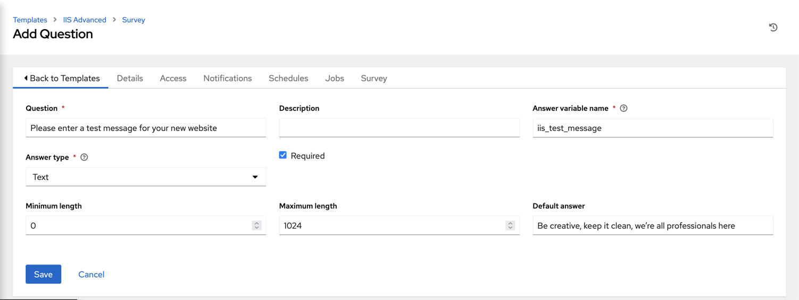
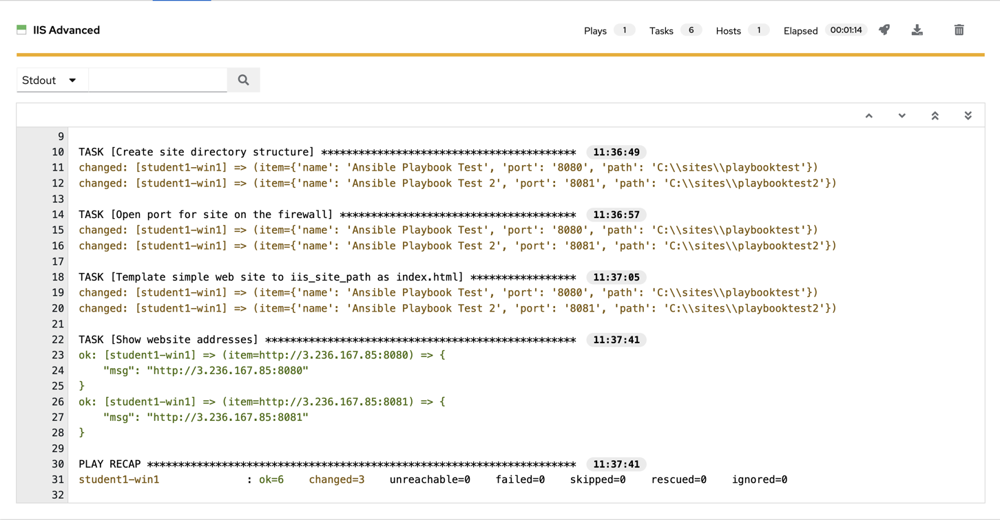

**Lisez ceci dans d'autres langues**:
<br> [English](README.md),  [日本語](README.ja.md),  [Française](README.fr.md).

Les exercices précédents vous ont montré les bases des playbooks Ansible. Dans les prochains exercices, nous allons voir des fonctionnalités ansibles plus avancées qui ajouteront de la flexibilité et de la puissance à vos playbook.

Ansible existe pour rendre les tâches simples et reproductibles. Nous savons également que tous les systèmes ne sont pas exactement pareils et nécessitent souvent de légères modifications par rapport à la façon dont un playbook Ansible est exécuté.

Les variables sont la façon dont nous traitons les différences entre vos systèmes, vous permettant de tenir compte d'un changement de port, d'adresse IP ou de répertoire.

Les boucles nous permettent de répéter la même tâche encore et encore. Par exemple, supposons que vous souhaitiez démarrer plusieurs services, installer plusieurs fonctionnalités ou créer plusieurs répertoires. En utilisant une boucle ansible, vous pouvez le faire en une seule tâche.

Parfois, vous souhaitez qu'une tâche ne s'exécute que lorsqu'une modification est apportée à une machine. Par exemple, vous souhaiterez peut-être redémarrer un service si une tâche met à jour la configuration de ce service, mais pas si la configuration est inchangée. Ansible utilise les *handlers* pour répondre à ce cas d'utilisation. Les *handlers* sont des tâches qui ne s'exécutent que lorsqu'elles sont notifiées.

Pour une compréhension complète des variables, des boucles et des handlers; consultez notre documentation Ansible sur ces sujets.


[Les Variables Ansible Variables](https://docs.ansible.com/ansible/latest/user_guide/playbooks_variables.html)
[Les Boucles Ansible](https://docs.ansible.com/ansible/latest/user_guide/playbooks_loops.html)
[Les Handlers](https://docs.ansible.com/ansible/latest/playbook_guide/playbooks_handlers.html#handlers)

Section 1: Création du Playbook
===============================

Pour commencer, nous allons créer un playbook, il va ressembler à celui que vous avez créé dans l'exercice 3

Étape 1:
--------
Dans Visual Studio Code, dans l'accordéon Explorer, vous devriez avoir une section *WORKSHOP_PROJECT* où vous avez précédemment créé `iis_basic`.


Étape 2: 
--------

Créez un dossier appelé **iis_advanced** et un fichier appelé `site.yml`


Pour cela passez la souris sur la section *WORKSHOP_PROJECT* et cliquez sur le bouton *Nouveau dossier*

Tapez `iis_advanced` et appuyez sur Entrée. Maintenant, cliquez sur ce dossier pour qu'il soit sélectionné.

Cliquez avec le bouton droit sur le dossier `iis_advanced` et sélectionnez *Nouveau fichier*.

Tapez `site.yml` et appuyez sur Entrée.

Vous devriez maintenant avoir un éditeur ouvert dans le volet droit qui peut être utilisé pour créer votre playbook.


Étape 3:
-------

Ajoutez les paramêtres de votre playbook ainsi que quelques variables. Ceux-ci incluent des packages supplémentaires que vous installerez sur votre serveur Web, ainsi que certaines configurations spécifiques au serveur Web.

```yaml
    ---
    - hosts: windows
      name: This is a play within a playbook
      vars:
        iis_sites:
          - name: 'Ansible Playbook Test'
            port: '8080'
            path: 'C:\sites\playbooktest'
          - name: 'Ansible Playbook Test 2'
            port: '8081'
            path: 'C:\sites\playbooktest2'
        iis_test_message: "Hello World!  My test IIS Server"
```

Étape 4:
-------

Ajoutez une nouvelle tâche appelée **installer IIS**. Après avoir écrit le playbook, cliquez sur `Fichier > Enregistrer` pour enregistrer vos modifications.

<!--  -->
```yaml
      tasks:
        - name: Install IIS
          win_feature:
            name: Web-Server
            state: present

        - name: Create site directory structure
          win_file:
            path: "{{ item.path }}"
            state: directory
          with_items: "{{ iis_sites }}"

        - name: Create IIS site
          win_iis_website:
            name: "{{ item.name }}"
            state: started
            port: "{{ item.port }}"
            physical_path: "{{ item.path }}"
          with_items: "{{ iis_sites }}"
          notify: restart iis service
```
<!--  -->

> **Que se passe-t-il ici!?**
> * `vars:` Vous avez dit à Ansible que la prochaine chose qu'il verra sera des variable
> * `iis_sites` Vous définissez une variable de type liste
> * `win_file`  Ce module permet de créer, modifier, supprimer des fichiers.
> * `{{ item }}` Vous dites à Ansible qu'il utilisera l'élément de la liste. Chaque élément a plusieurs variables comme `nom`, `port` et `path`
> * `with_items: "{{ iis_sites }}` Ceci est la boucle qui va itérer sur chaque éléments de la variable `iis_sites`
> * `notify: restart iis service` Cette instruction est un `handler`, nous y reviendrons dans la section 3


Section 2: Ouverture du pare-feu et déploiement de fichiers
===========================================================

Vous allez maintenant définir une tâche pour démarrer le service IIS.

Étape 1:
-------

Créez un répertoire `templates` dans votre répertoire de projet et créez une template jinja2 comme suit:

Assurez-vous que votre `dossier iis_advanced` est mis en surbrillance, puis survolez la section *WORKSHOP_PROJECT* et cliquez sur le bouton *Nouveau dossier*

Tapez `templates` et appuyez sur Entrée. Cliquez avec le bouton droit sur le dossier *templates* et cliquez sur le bouton *Nouveau fichier*.

Tapez `index.html.j2` et appuyez sur Entrée.

Vous devriez maintenant avoir un éditeur ouvert dans le volet droit qui pourra être utilisé pour créer votre template. Saisissez les informations suivantes:

<!--  -->
```html
    <html>
    <body>

      <p align=center>
      <h1 align=center>{{ ansible_hostname }} --- {{ iis_test_message }}</h1>

    </body>
    </html>
```
<!--  -->


Étape 2:
-------

Modifiez votre playbook, `site.yml`, pour ouvrire les ports de votre pare-feu. Utilisez des guillemets simples pour `win_template` afin de ne pas échapper à la barre oblique.

<!--  -->
```yaml
        - name: Open port for site on the firewall
          win_firewall_rule:
            name: "iisport{{ item.port }}"
            enable: yes
            state: present
            localport: "{{ item.port }}"
            action: Allow
            direction: In
            protocol: Tcp
          with_items: "{{ iis_sites }}"

        - name: Template simple web site to iis_site_path as index.html
          win_template:
            src: 'index.html.j2'
            dest: '{{ item.path }}\index.html'
          with_items: "{{ iis_sites }}"

        - name: Show website addresses
          debug:
            msg: "{{ item }}"
          loop:
            - http://{{ ansible_host }}:8080
            - http://{{ ansible_host }}:8081
```
<!--  -->


> **Alors… qu'est-ce que je viens d'écrire?**
> * `win_firewall_rule:` Ce module est utilisé pour créer, modifier et mettre à jour des règles de pare-feu. Notez que dans le cas d'AWS, il existe également des règles de groupe de sécurité qui peuvent avoir un impact sur la communication. Nous les avons ouverts dans cet exemple.
> * `win_template:` Ce module spécifie qu'un modèle jinja2 est utilisé et déployé.
> * `debug:` Encore une fois, comme dans le playbook `iis_basic`, cette tâche affiche les URL pour accéder aux sites que nous créons pour cet exercice


Section 3: Définition et utilisation des handlers
=================================================

Il y a un certain nombre de raisons pour lesquelles nous devons souvent redémarrer un service / processus, y compris le déploiement d'un fichier de configuration, l'installation d'un nouveau package, etc. Il y a deux parties dans cette section; ajouter un handler au playbook et appeler le handler depuis une tâche. 

Nous allons voir ici la création d'un handler.

Le bloc `handlers` devrait commencer après une indentation à un niveau, c'est-à-dire deux espaces. Il doit s'aligner sur le bloc `tâches`.

Étape 1:
-------

Définir un handler.

```yaml
      handlers:
        - name: restart iis service
          win_service:
            name: W3Svc
            state: restarted
            start_mode: auto
```

> **L'un ne va pas sans l'autre**
> * `handler:` Cela indique au **play** que les `tâches:` sont terminées, et maintenant nous définissons les `handlers:`. Tout ce qui se trouve en dessous ressemble à n'importe quelle autre tâche, c'est-à-dire que vous lui donnez un nom, un module et les options de ce module mais Il s'agit de la définition des handlers.
> * `notify: restart iis service` Finalement, l'instruction `notify` est l'invocation d'un handler par son nom. Vous avez déjà remarqué que nous avons ajouté une instruction `notify` à la tâche `win_iis_website`, vous savez maintenant pourquoi.

Section 4: Valider et réviser
=============================

Votre nouveau playbook amélioré est terminé! Mais n'oubliez pas que nous devons encore valider les modifications apportées au contrôle du code source.

Cliquez sur `Fichier` > `Tout enregistrer` pour enregistrer les fichiers que vous avez écrits


Cliquez sur l'icône du code source (1), saisissez un message de validation tel que *Ajout d'un playbook avancé* (2), puis cochez la case ci-dessus (3).


Synchronisez-vous avec gitlab en cliquant sur les flèches dans la barre bleue en bas à gauche. Lorsque vous y êtes invité, cliquez sur *OK* pour pousser les changements.


Cela devrait prendre 5 à 30 secondes pour terminer la validation. La barre bleue devrait s'arrêter de tourner et indiquer 0 problème…

Jetons maintenant un deuxième coup d'œil pour nous assurer que tout ressemble à ce que vous vouliez. La figure ci-dessous montre le nombre de lignes et l'espacement.

<!--  -->
```yaml
    ---
    - hosts: windows
      name: This is a play within a playbook
      vars:
        iis_sites:
          - name: 'Ansible Playbook Test'
            port: '8080'
            path: 'C:\sites\playbooktest'
          - name: 'Ansible Playbook Test 2'
            port: '8081'
            path: 'C:\sites\playbooktest2'
        iis_test_message: "Hello World!  My test IIS Server"

      tasks:
        - name: Install IIS
          win_feature:
            name: Web-Server
            state: present

        - name: Create site directory structure
          win_file:
            path: "{{ item.path }}"
            state: directory
          with_items: "{{ iis_sites }}"

        - name: Create IIS site
          win_iis_website:
            name: "{{ item.name }}"
            state: started
            port: "{{ item.port }}"
            physical_path: "{{ item.path }}"
          with_items: "{{ iis_sites }}"
          notify: restart iis service

        - name: Open port for site on the firewall
          win_firewall_rule:
            name: "iisport{{ item.port }}"
            enable: yes
            state: present
            localport: "{{ item.port }}"
            action: Allow
            direction: In
            protocol: Tcp
          with_items: "{{ iis_sites }}"

        - name: Template simple web site to iis_site_path as index.html
          win_template:
            src: 'index.html.j2'
            dest: '{{ item.path }}\index.html'
          with_items: "{{ iis_sites }}"

        - name: Show website addresses
          debug:
            msg: "{{ item }}"
          loop:
            - http://{{ ansible_host }}:8080
            - http://{{ ansible_host }}:8081

      handlers:
        - name: restart iis service
          win_service:
            name: W3Svc
            state: restarted
            start_mode: auto
```
<!--  -->

Section 5: Créez un modèle de tache
===================================

Étape 1:
-------

Avant que nous puissions créer notre modèle de tache, vous devez d'abord recommencer la resynchronisation de votre projet. Faites-le maintenant.

> **Note**
> Vous devez le faire chaque fois que vous créez un nouveau fichier de playbook. Le nouveau fichier doit être synchronisé avec Controller avant qu'il ne devienne disponible dans la liste déroulante des Playbook disponibles .

Étape 2:
-------

Pour tester ce playbook, nous devons créer un nouveau modèle de tâche. Allez donc dans *Modèle* et cliquez sur *Ajouter* et sélectionnez "Modèle de tache".

Remplissez le formulaire en utilisant les valeurs suivantes

| Key         | Value                      | Note |
|-------------|----------------------------|------|
| Name        | IIS Advanced               |      |
| Description | Template for iis_advanced  |      |
| Job Type    | Run                        |      |
| Inventory   | Workshop Inventory |      |
| Execution Environment     | windows workshop execution environment   |      |
| Project     | Ansible Workshop Project   |      |
| Playbook    | `iis_advanced/site.yml`    |      |
| Credentials  | Workshop Credential            |      |
| OPTIONS     | [\*] Enable Fact Storage         |      |


Étape 3:
-------

Cliquez sur `ENREGISTRER`  puis sélectionnez `Ajouter un questionnaire`
!

Étape 4:
-------

Remplissez le formulaire avec les valeurs suivantes

| Clé                    | Valeur                                                   | Note |
|------------------------|----------------------------------------------------------|------|
| PROMPT                 | Please enter a test message for your new website         |      |
| DESCRIPTION            | Website test message prompt                              |      |
| ANSWER VARIABLE NAME   | `iis_test_message`                                       |      |
| ANSWER TYPE            | Text                                                     |      |
| MINIMUM/MAXIMUM LENGTH | Use the defaults                                         |      |
| DEFAULT ANSWER         | Be creative, keep it clean, we’re all professionals here |      |



Étape 5:
-------

Select SAVE  et n'oubliez pas de mettre la switch à **On** 


Section 6: Lancez votre nouveau playbook
========================================

Maintenant, exécutons-le et voyons comment cela fonctionne.

Étape 1:
-------

Selectionnez `Modèles`

> **Remarque**
> Sinon, si vous n'avez pas quitté la page de création de modèles de travail, vous pouvez faire défiler vers le bas pour voir tous les modèles de tâche existants

Étape 2:
--------

Cliquez sur l'icône de la fusée  pour le modele **IIS Advanced**.

Étape 3:
--------

Lorsque vous y êtes invité, entrez le message de test souhaité

Après son lancement, vous pouvez regarder l'éxécution de la tâche en temps réel.

Une fois la tâche terminé, vous devriez voir deux URL de vos sites Web affiché en resultat.




<br><br>
[Cliquez ici pour revenir à l'atelier Ansible pour Windows](../README.fr.md)
