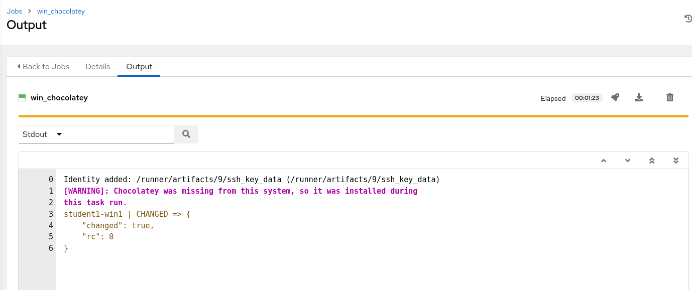
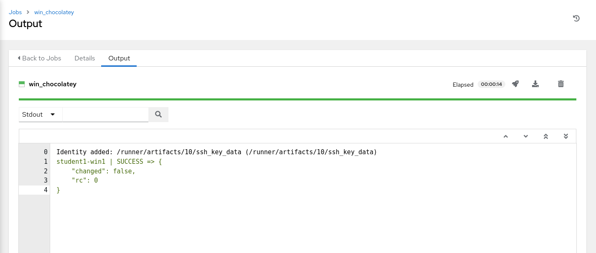
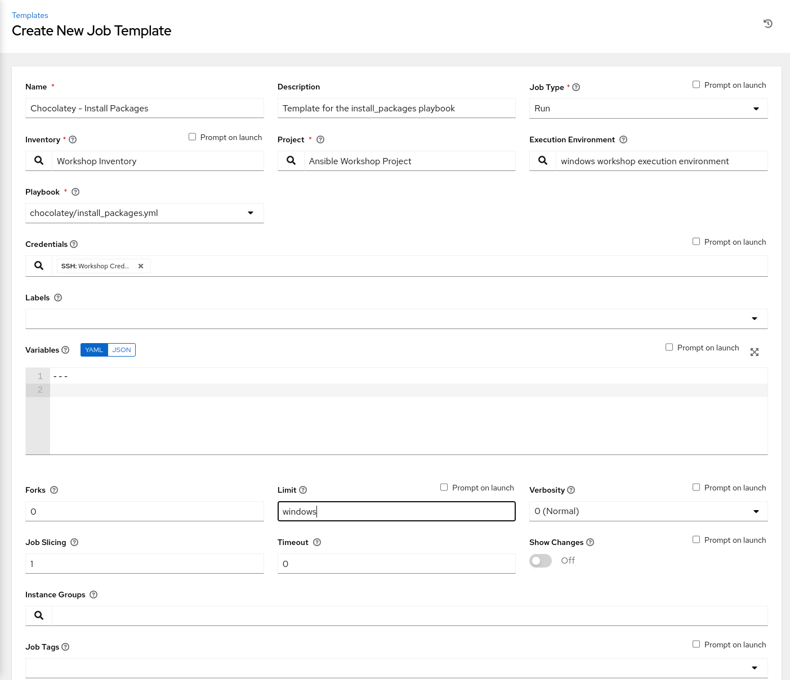
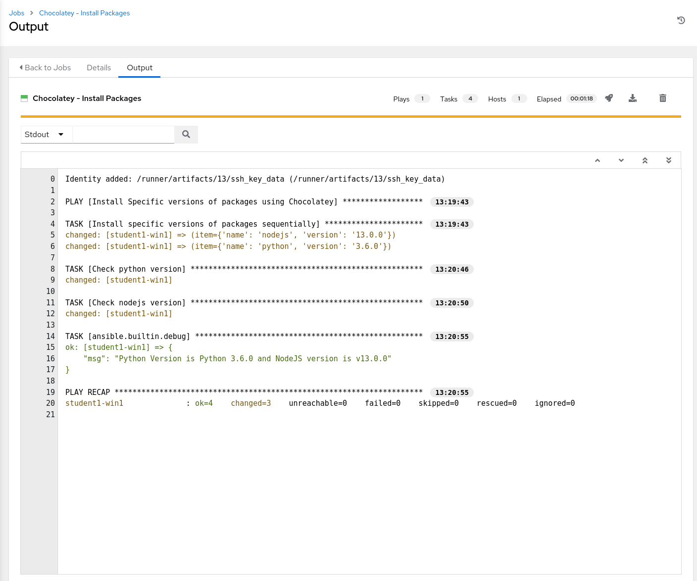
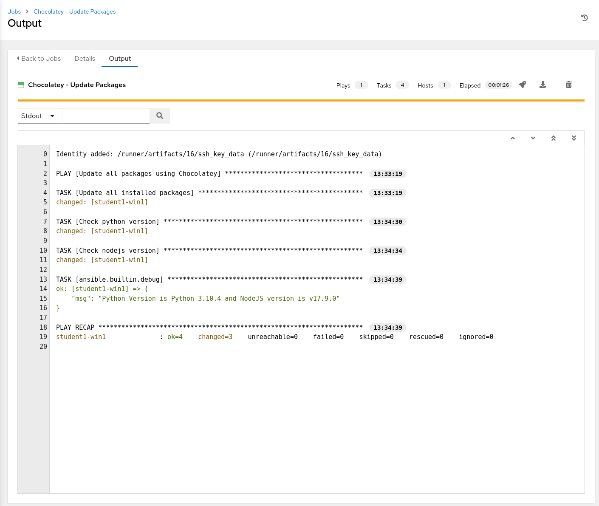
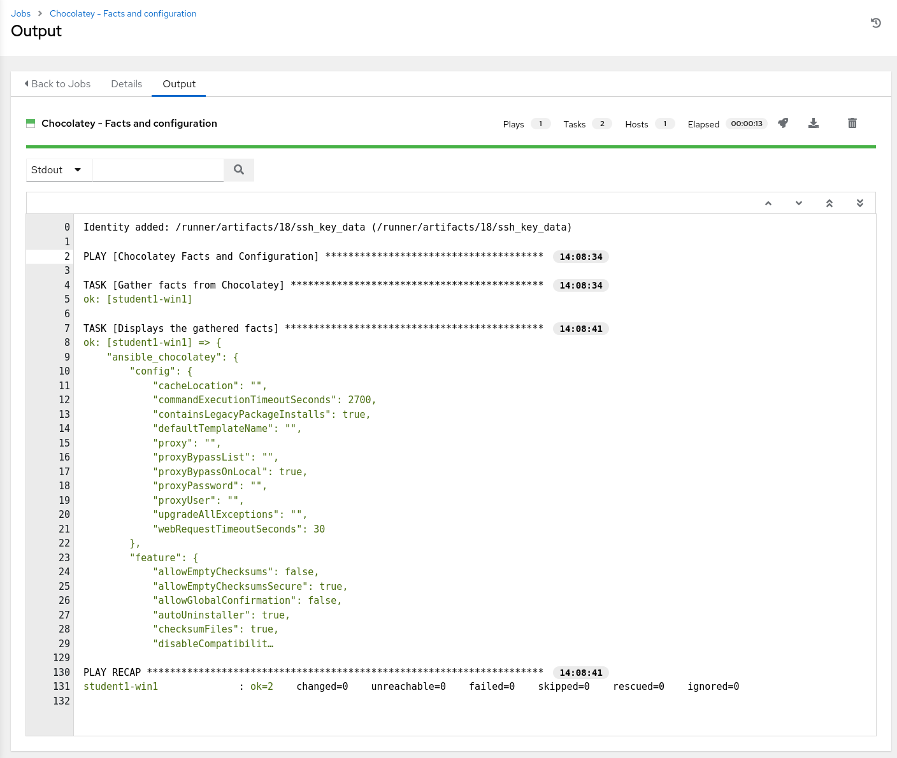
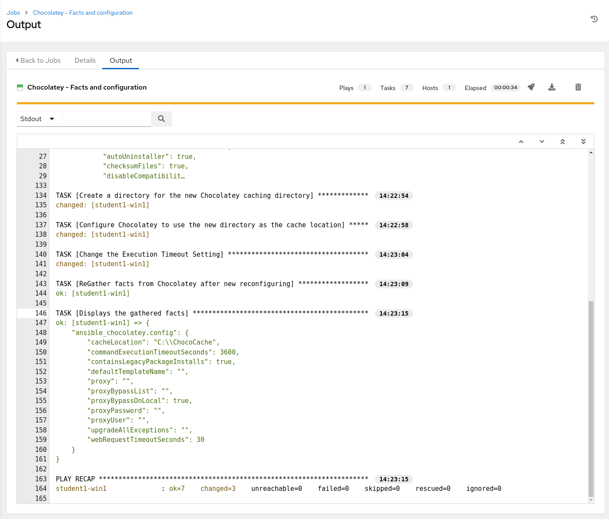

この演習では、Chocolateyを利用してどのようにWindows上のソフトウェアを簡単に管理するかについてご紹介します。インストール、アップデートとアンインストール、異なるソースの管理、chocolateyクライアントの構成やシステム管理者が行う一般的なタスクについて取り扱います。

Chocolateyとは何でしょうか。簡単に説明すると、ChocolateyはWindows用のパッケージ管理システムです。Chocolateyは、シンプルかつ簡単にWindowsソフトウェアのライフサイクル全体を自動化します。

オープンソース版のChocolateyクライアントは基本的なパッケージ管理が可能ですが、Chocolatey For Businessスイートでは先進的な管理を提供しています。以下にいくつかピックアップします。

* Package Builder では、任意の EXE、MSI、ZIP、スクリプトを、わずか5秒でChocolatey パッケージに自動的に変換することができます (インストーラのサイレント引数も計算してくれます)。
* Package Internalizer は、Chocolatey Community Repositoryでメンテナが既に構築した8000以上のパッケージを取得し、内部で使用するためのローカライズされたオフラインバージョンを作成します（依存関係を含む）。
* Package Synchronizer は、プログラムと機能に掲載されているアプリケーションの Chocolatey パッケージを作成し、他のパッケージと同様に管理することができます。
* Chocolatey Self-Service GUI では、エンドユーザが管理者権限や昇格権限を必要とせずにパッケージを管理することができます。
* Chocolatey Central Management は Web ダッシュボードと API (Ansible Tower に似ています) で、エンドポイント全体のハイレベルな概要とレポートを提供します。

*************************************************************************************************

# セクション 1: `win_chocolatey` モジュール

## ステップ 1 - アドホックコマンドでパッケージをインストールする

まず最初に、アドホックコマンドで `win_chocolatey` モジュールを利用して、`git` をインストールします。`win_chocolatey` モジュールは、Chocolateyを利用してWindows上のパッケージを管理します。 
<br>
まず、左側の「**インベントリー**」をクリックし、「**Workshop Inventory**」を選択します。インベントリの詳細ページに移動しますが、対象となるホストを選択する必要があります。ですので、まず「**ホスト**」をクリックします。

各ホストの隣にチェックボックスがあります。アドホックコマンドを実行したいホストの隣のチェックボックスを選択します。 すると「**コマンドの実行**」ボタンが有効化されますので、クリックします。


ボタンをクリックすると「**コマンドの実行**」ウィンドウが表示されます。ここで各ホストに対して単一のタスクを実行できます。

以下の通りに入力します:

| Key                | Value                    | Note                                                            |
|--------------------|--------------------------|-----------------------------------------------------------------|
| モジュール         | `win_chocolatey`         |                                                                 |
| 引数               | `name=git state=present` | パッケージの名前と状態                                          |
| 制限               |                          | 選択したホストがあらかじめ入力されています                      |
| マシンの認証情報   | Student Account          |                                                                 |


「**実行**」をクリックすると、ジョブの実行ログに遷移します。

ジョブ出力では、以下のような実行結果を確認できます:



Changedが表示されれば、`git` が正しくインストールされています。Chocolateyクライアントが存在しないという警告も表示されていますので、タスクの実行時にクライアントもインストールされています。以降のタスクでは `win_chocolatey` モジュールはクライアントを検知し、あらたにインストールせずに既存のクライアントを使用します。検証するために、「**詳細**」セクションのロケットアイコンをクリックして、ジョブを再実行します。すると、警告が表示されず、（多くのAnsibleモジュールと同様に) `win_chocolatey` モジュールはべき等性が担保されているため、変更は加えられずsuccessとして表示されます。また、前回は2つのパッケージをインストールしましたが、今回は何もインストールしていないため、タスクの実行時間もより短くなります。



このような感じで `git` がインストールされました。

## ステップ 2 - 特定のバージョンの複数のパッケージをインストールする

前のステップではひとつのパッケージをアドホックにインストールしましたが、実際にはパッケージのインストールを複数のステップの中のひとつとして含めることの方が多いでしょう。また、複数のパッケージ（場合によっては特定のバージョンのパッケージも）をインストールしたい場合もあるでしょう。この演習では、まさにそれを行います。

まずは、Visual Studio Codeに戻ります。「*WORKSHOP_PROJECT*」セクションの下に 「**chocolatey**」という名前のディレクトリを作成して
「`install_packages.yml`」というファイルを作成します。

これで、右ペインにPlaybookの作成に使用できるエディタが表示されます。

<!-- TODO: INSERT Image of Empty text editor here-->
<!--  -->


まずはプレイを定義します:

```yaml
---
- name: Install Specific versions of packages using Chocolatey
  hosts: all
  gather_facts: false
  vars:
    choco_packages:
      - name: nodejs
        version: 13.0.0
      - name: python
        version: 3.6.0

```

Ansibleによって収集されるファクトは必要ないので、オーバーヘッドを減らすために、`gather_facts: false` と設定してファクト収集を無効にしました。また、`vars` ディレクティブで `choco_packages` という名前の辞書変数を定義し、Chocolateyを使ってインストールしたいパッケージの名前とバージョンを格納しました。

次にタスクを追加します:

```yaml
  tasks:

  - name: Install specific versions of packages sequentially
    win_chocolatey:
      name: "{{ item.name }}"
      version: "{{ item.version }}"
    loop: "{{ choco_packages }}"

  - name: Check python version
    win_command: python --version
    register: check_python_version

  - name: Check nodejs version
    win_command: node --version
    register: check_node_version

  - debug:
      msg: Python Version is {{ check_python_version.stdout_lines[0] }} and NodeJS version is {{ check_node_version.stdout_lines[0] }}
```

4つのタスクをtasksセクションに追加します:

* 最初のタスクは、`win_chocolatey`モジュールを使用し、`choco_packages`変数をループして、指定されたバージョンの各製品をインストールします。
* 2番目と3番目のタスクは、`win_command`モジュールを使用して、それぞれ `python` と `node` のバージョンをチェックするコマンドを実行し、それぞれの出力を登録します。
* 最後の4つ目のタスクでは、`debug`モジュールを使用して、ステップ2と3で収集した情報を含むメッセージを表示します。

> **Tip**
>
> `win_chocolatey`モジュールの`name`属性は、実際にはパッケージのリストを指定できますのでloopを使う必要はありません。しかし、loopを使用することで各パッケージのバージョンを指定し、順序が関連する場合は、それらを順番にインストールすることができます。`win_chocolatey`モジュールの詳細については、[ドキュメント](https://docs.ansible.com/ansible/latest/modules/win_chocolatey_module.html)を参照してください。.

`install_packages.yml` プレイブック全体はこのようになります:

```yaml
---
- name: Install Specific versoins of packages using Chocolatey
  hosts: all
  gather_facts: false
  vars:
    choco_packages:
      - name: nodejs
        version: 13.0.0
      - name: python
        version: 3.6.0
  tasks:

  - name: Install specific versions of packages sequentially
    win_chocolatey:
      name: "{{ item.name }}"
      version: "{{ item.version }}"
    loop: "{{ choco_packages }}"

  - name: Check python version
    win_command: python --version
    register: check_python_version

  - name: Check nodejs version
    win_command: node --version
    register: check_node_version

  - debug:
      msg: Python Version is {{ check_python_version.stdout_lines[0] }} and NodeJS version is {{ check_node_version.stdout_lines[0] }}
```

これでPlaybookは準備完了です:

* メニューから `File > Save` をクリックしてファイルを保存します(もしくはCtrl+Sを押します)。
* gitに変更をCommitします - *Adding install\_packages.yml* のような関連性のあるコミットメッセージを使用します。
* 丸い矢印をクリックして、Commitされた変更をリポジトリにPushします。
* (任意) コードがgitに追加されていることを確認するには、「**GitLab Access**」の情報を使ってGitLabにアクセスします。

次に、Ansible Towerに戻り、プロジェクトを同期してTower が新しいプレイブックをピックアップするようにします。「**プロジェクト**」をクリックし、プロジェクトの横にある「同期」アイコンをクリックします。


これが完了したら、新しいジョブテンプレートを作成します。**テンプレート**を選択し、アイコンをクリックし、ジョブテンプレートを選択します。新しいジョブテンプレートには、以下の値を使用します:

| Key            | Value                                            | Note |
|----------------|--------------------------------------------------|------|
| 名前           | Chocolatey - Install Packages                    |      |
| 説明           | Template for the install_packages playbook       |      |
| ジョブタイプ   | 実行                                             |      |
| インベントリー | Workshop Inventory                               |      |
| プロジェクト   | Ansible Workshop Project                         |      |
| PLAYBOOK       | `chocolatey/install_packages.yml`                |      |
| 認証情報       | タイプ: **マシン**. 名前: **Student Account**    |      |
| 制限           | windows                                          |      |
| オプション     |                                                  |      |

<br>



「保存」をクリックした後に、「実行」をクリックしてジョブを実行します。 ジョブが正常に完了し、ループ処理で変数に指定したパッケージがインストールされているはずです。



> **Tip**
>
> ここまでくると、プレイブックの作成や編集、変更のコミット、gitへのプッシュといった流れに慣れてきたはずです。また、プロジェクトを更新したり、Ansible Tower でジョブテンプレートを作成して実行したりすることにも慣れているはずです。以降の手順では、それらの各ステップのリストはなくなります。

## ステップ 3 - インストールされているパッケージをすべてアップデートする

`win_chocolatey` モジュールは、単にパッケージをインストールするだけではなく、パッケージをアンインストールしたり、アップデートしたりするのにも使われます。モジュールが行うアクションは、`state` パラメータに渡す値に基づいています。渡せるオプションには次のようなものがあります:

* `present`: パッケージがインストールされていることを保証する。
* `absent` : パッケージがインストールされていないことを保証する。
* `latest`: 最新のバージョンのパッケージがインストールされていることを保証する。

前回のプレイブックでは、`state` の値を明示的に定義していなかったため、パッケージをインストールする際のstateパラメータの設定値としてデフォルトの `present` が使用されていました。意図的に古いバージョンのパッケージをインストールしてしまったため、今度はそれらのパッケージをアップデートします。

Visual Studio Codeで、`chocolatey` フォルダの下に、「`update_packages.yml`」という名前で新しいファイルを作成します。このプレイブックでは、`win_chocolatey`モジュールを使用して、`state`パラメータの値として「`latest`」を指定したプレイを作成します。Chocolateyによって以前にインストールされたすべてのパッケージを更新したいので、`name`パラメータには特定のパッケージ名を指定せず、代わりに「`all`」という値を使用します。

> **Tip**
>
> `name` 属性にセットされる値として `all` を使用する情報は、`win_chocolatey` のモジュール[ドキュメント](https://docs.ansible.com/ansible/latest/modules/win_chocolatey_module.html)にあります。初めて使うモジュールのドキュメントは必ずチェックしてください。多くの場合、作業の手間を省く有益な情報があります。

`update_packages.yml` の内容は以下のようになります:

```yaml
---
- name: Update all packages using Chocolatey
  hosts: all
  gather_facts: false
  tasks:

  - name: Update all installed packages
    win_chocolatey:
      name: all
      state: latest

  - name: Check python version
    win_command: python --version
    register: check_python_version

  - name: Check nodejs version
    win_command: node --version
    register: check_node_version

  - debug:
      msg: Python Version is {{ check_python_version.stdout_lines[0] }} and NodeJS version is {{ check_node_version.stdout_lines[0] }}
```


他のタスクは、アップデートタスクが実行された後に、`nodejs`と`python`のバージョンを確認するためにあります。それだけです、簡単ですね。

次に、新しいプレイブックがGitに登録され、Ansible Towerに表示されていることを確認してから、以下の値で新しいジョブテンプレートを作成して実行します:

> **Tip**
>
> ほぼすべてがパッケージをインストールするために作成した最初のジョブテンプレートと同じですので、`テンプレート` のページで「`Chocolatey - Install Packages`」テンプレートの隣にある  アイコンをクリックすることでコピーすることができます。 これでテンプレートのコピーが作成されるので、テンプレートの名前をクリックして編集し、名前、説明、実行するプレイブックを変更することができます。また、プレイブックを1から作成することもできますので、お好みでお選びください。

| Key             | Value                                            | Note |
|-----------------|--------------------------------------------------|------|
| 名前            | Chocolatey - Update Packages                     |      |
| 説明            | Template for the update_packages playbook        |      |
| ジョブタイプ    | 実行                                             |      |
| インベントリー  | Workshop Inventory                               |      |
| プロジェクト    | Ansible Workshop Project                         |      |
| PLAYBOOK        | `chocolatey/update_packages.yml`                 |      |
| 認証情報        | タイプ: **マシン**. 名前: **Student Account**    |      |
| 制限            | windows                                          |      |
| オプション      |                                                  |      |

新しいテンプレートを実行した後、`debug` タスクメッセージを調べて、`install_packages` ジョブの出力から得られたバージョンと比較してください。これらのパッケージはアップデートされているので、バージョンは新しくなっているはずです（アドホックコマンドでインストールした `git` パッケージもアップデートがあるかどうかチェックされますが、インストールして数分後にアップデートがあるとは思えません）。


# セクション 2: Chocolateyのファクトと設定

Chocolatey でパッケージを管理するために実際に使用されるのは `win_chocolatey` モジュールですが、Ansible で使用できる唯一の Chocolatey モジュールではありません。この演習では、そのうちの2つを見てみましょう。「`win_chocolatey_facts`」と「`win_chocolatey_config`」です。

## ステップ 1 - Chocolateyのファクトの収集

最初に使用するモジュールは、「`win_chocolatey_facts`」モジュールです。このモジュールは、Chocolateyからインストールされたパッケージ、設定、機能、ソースなどの情報を収集するために使用します。これらの情報は、レポート生成などのタスクや、他のタスクで定義された条件分岐などに役立ちます。

> **Tip**
>
> 「`win_chocolatey_facts`」モジュールの詳細については、[ドキュメント](https://docs.ansible.com/ansible/latest/modules/win_chocolatey_facts_module.html)を参照してください。

それでは、収集した情報を表示する簡単なプレイブックを作成し、収集した情報を詳しく見てみましょう。

Visual Studio Codeで、`chocolatey`フォルダの下に、「`chocolatey_configuration.yml`」という新しいファイルを作成します。そのファイルの内容は以下のようにします。

```yaml
---
- name: Chocolatey Facts and Configuration
  hosts: all
  gather_facts: false
  tasks:

  - name: Gather facts from Chocolatey
    win_chocolatey_facts:

  - name: Displays the gathered facts
    debug:
      var: ansible_chocolatey
```

最初のタスクでは、`win_chocolatey_facts` を使用して、対象となる Windows マシン上の Chocolatey から利用可能なすべての情報を収集し、この情報を `ansible_chocolatey` という変数に格納し、`debug` モジュールを使用してその内容を表示して詳しく調べます。

新しいプレイブックをソースコントロールのリポジトリに追加し、Ansible Towerでプロジェクトを同期してから、以下の値で新しいジョブテンプレートを作成して実行します。

| Key            | Value                                              | Note |
|----------------|----------------------------------------------------|------|
| 名前           | Chocolatey - Facts and configuration               |      |
| 説明           | Template for the chocolatey_configuration playbook |      |
| ジョブタイプ   | 実行                                               |      |
| インベントリー | Workshop Inventory                                 |      |
| プロジェクト   | Ansible Workshop Project                           |      |
| PLAYBOOK       | `chocolatey/chocolatey_conguration.yml`            |      |
| 認証情報       | タイプ: **Machine**. 名前: **Student Account**     |      |
| 制限           | windows                                            |      |
| オプション     |                                                    |      |

<br>

ジョブの出力には、最初のタスクで収集した `ansible_chocolatey` 変数の内容が表示されます。



出力をスクロールして値を確認すると、Windows ターゲット上の Chocolatey クライアントの構成、有効な機能と無効な機能、インストールされているパッケージ (以前の演習でインストールしたパッケージが確認できますか？)、およびパッケージをインストールしているソース (これについては後で詳しく説明します) がわかります。これらの情報はJSON形式なので、オブジェクトツリーをたどって個々の値にアクセスできることに注意してください。例えば、インストールされたパッケージのレポートを作成するために、インストールされたパッケージの情報だけに興味がある場合は、`ansible_chocolatey.packages`キーを使ってこれらの値にアクセスできます。

<br>

> **Tip**
>
> `win_chocolatey_facts` モジュールが収集した情報を見るために、`debug` タスクを使う必要は本当にありませんでした。
代わりに、Ansible Tower のジョブ出力ペインで、Windows ターゲットでタスクを実行した結果をクリックすると、その特定のホストのホストイベントダイアログが開き、選択したイベントの影響を受けるホストに関する情報と、そのイベントの出力が表示されます（この場合、`win_chocolatey_facts` モジュールの実行によって返された JSON オブジェクトです）。

<br>

## ステップ 2 - Chocolateyの設定

前のステップでは、Windows ターゲット上の Chocolatey クライアントの設定を `win_chocolatey_facts` モジュールを使って収集できることを確認しましたが、これらの設定を変更したい場合はどうすればよいでしょうか。そのためのモジュールが用意されています。

`win_chocolatey_config`モジュールは、設定オプションの値を変更したり、すべての設定を解除したりして、Chocolateyの設定を管理することができます。

<br>

> **Tip**
>
> `win_chocolatey_config` モジュールの詳細については、[ドキュメント](https://docs.ansible.com/ansible/latest/modules/win_chocolatey_config_module.html)を参照してください。

<br>

> **Tip**
>
> Chocolateyの設定については [こちら](https://chocolatey.org/docs/chocolatey-configuration)を参照してください。

ここでは、2つの設定オプションの値を変更します。`cacheLocation` と `commandExecutionTimeoutSeconds` です。前のステップの出力では、`cacheLocation` が設定されていないか、デフォルトの設定である値が設定されていないことがわかりました。また、`commandExecutionTimeoutSeconds` の値はデフォルトの 2700 に設定されていました。これらの設定オプションを次のように修正します:

* `cacheLocation` を `C:\ChocoCache`に設定
* `commandExecutionTimeoutSeconds` を1時間もしくは `3600` 秒に設定

Visual Studio Codeで、`chocolatey_configuration.yml` プレイブックを編集し以下のタスクを追加します:

```yaml
  - name: Create a directory for the new Chocolatey caching directory
    win_file:
      path: C:\ChocoCache
      state: directory

  - name: Configure Chocolatey to use the new directory as the cache location
    win_chocolatey_config:
      name: cacheLocation
      state: present
      value: C:\ChocoCache

  - name: Change the Execution Timeout Setting
    win_chocolatey_config:
      name: commandExecutionTimeoutSeconds
      state: present
      value: 3600

  - name: ReGather facts from Chocolatey after new reconfiguring
    win_chocolatey_facts:

  - name: Displays the gathered facts
    debug:
      var: ansible_chocolatey.config
```

これらの新しいタスクは以下を実行します:

* `win_file` モジュールを使用し `C:\ChocoCache` ディレクトリを作成
* 新しく作成した `win_chocolatey_config` ディレクトリを使用するように `cacheLocation` の値を変更
* `commandExecutionTimeoutSeconds` を `3600`に変更
* 設定値を変更した後にChocolateyファクトを再収集
* 最後に更新したChocolateyファクトの`config` セクションを表示

これで、`chocolatey_configuration.yml` プレイブックの内容は以下のようになります:

```yaml
---
- name: Chocolatey Facts and Configuration
  hosts: all
  gather_facts: false
  tasks:

  - name: Gather facts from Chocolatey
    win_chocolatey_facts:

  - name: Displays the gathered facts
    debug:
      var: ansible_chocolatey

  - name: Create a directory for the new Chocolatey caching directory
    win_file:
      path: C:\ChocoCache
      state: directory

  - name: Configure Chocolatey to use the new directory as the cache location
    win_chocolatey_config:
      name: cacheLocation
      state: present
      value: C:\ChocoCache

  - name: Change the Execution Timeout Setting
    win_chocolatey_config:
      name: commandExecutionTimeoutSeconds
      state: present
      value: 3600

  - name: ReGather facts from Chocolatey after new reconfiguring
    win_chocolatey_facts:

  - name: Displays the gathered facts
    debug:
      var: ansible_chocolatey.config
```

変更をコミットしてソースコントロールにプッシュし、Ansible Towerでプロジェクトを同期させ、「`Chocolatey - Facts and Configuration`」ジョブテンプレートを実行します。
> **Tip**
>
> [演習 1](../1-tower)で、 Ansible Towerでプロジェクトを作成した際に「`起動時のリビジョン更新`」にチェックをいれました。ですので、プロジェクトを更新する必要はありません。しかし、もしこのチェックを忘れていた場合は……。

プレイブックが実行されて設定が変更され、最後の `debug` タスクの出力である `ansible_chocolatey.config` セクションの値に変更が反映され、`cacheLocation` と `commandExecutionTimeoutSeconds` の新しい値が表示されるはずです。



<br><br>

これで演習は完了です。 この演習では、利用可能なChocolatey関連のAnsibleモジュールのほとんどをカバーしました(ただし、`win_chocolatey_source` と `win_chocolatey_feature` については [こちら](https://docs.ansible.com/ansible/latest/modules/win_chocolatey_feature_module.html) と [こちら](https://docs.ansible.com/ansible/latest/modules/win_chocolatey_source_module.html) を参照してください)。 Windowsパッケージの管理にAnsibleとChocolateyを併用することで、その可能性を感じていただけたのではないでしょうか。

<br><br>
[ワークショップ一覧に戻る](../README.ja.md)